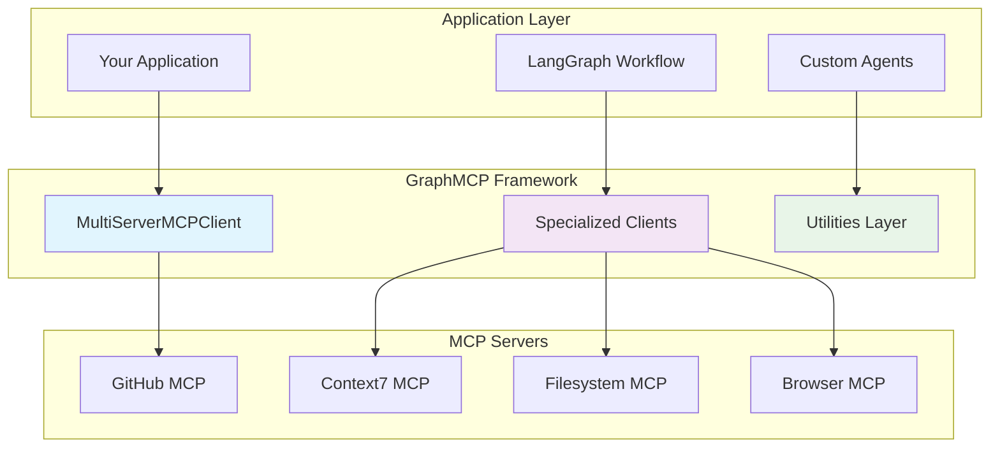

# GraphMCP Usage Guide

> **🎯 Comprehensive guide for building reliable MCP-based applications with GraphMCP**

## Table of Contents

1. [Architecture Overview](#architecture-overview)
2. [Quick Start Patterns](#quick-start-patterns)
3. [Best Practices](#best-practices)
4. [Common Pitfalls & Solutions](#common-pitfalls--solutions)
5. [Design Patterns](#design-patterns)
6. [Performance Guidelines](#performance-guidelines)
7. [Error Handling Strategies](#error-handling-strategies)
8. [Migration Guide](#migration-guide)
9. [Troubleshooting](#troubleshooting)

---

## Architecture Overview

GraphMCP is a **framework for frameworks** that provides structured, reusable patterns for building MCP-based applications. It extracts proven patterns from real-world implementations.



### Core Design Principles

| Principle | Description | Benefit |
|-----------|-------------|---------|
| **Never Store MCP Objects** | Avoid storing actual mcp_use client/session objects | Prevents serialization issues |
| **Always Ensure Serializability** | All returned data is pickle-safe | LangGraph compatibility |
| **Proven Patterns Only** | Extracted from working implementations | High reliability |
| **Graceful Degradation** | Comprehensive error handling | Robust applications |
| **Resource Cleanup** | Explicit session cleanup | Memory efficiency |

---

## Quick Start Patterns

### 🚀 Pattern 1: Drop-in Replacement

**Use Case**: Migrate existing DirectMCPClient code with zero changes

```python
# OLD: DirectMCPClient
# from your_old_package import DirectMCPClient

# NEW: GraphMCP MultiServerMCPClient  
from graphmcp import MultiServerMCPClient as DirectMCPClient

# Same interface, better architecture
client = DirectMCPClient.from_config_file("config.json")

# All existing methods work exactly the same
github_result = await client.call_github_tools("https://github.com/microsoft/typescript")
docs = await client.call_context7_tools("react hooks", library_id="/react/docs")
```

**✅ When to Use**: Legacy code migration, gradual adoption

**⚠️ Pitfall to Avoid**: Don't mix old and new imports in the same codebase

### 🎯 Pattern 2: Specialized Client Usage

**Use Case**: New applications that need focused, type-safe operations

```python
from graphmcp import GitHubMCPClient, Context7MCPClient

# Type-safe, structured results
github = GitHubMCPClient("config.json")
context7 = Context7MCPClient("config.json")

# Rich data models instead of strings
repo_analysis = await github.analyze_repository("https://github.com/facebook/react")
print(f"Files: {len(repo_analysis.files_found)}")
print(f"Stack: {repo_analysis.tech_stack}")

# Structured documentation
docs = await context7.get_library_docs("/react/docs", topic="hooks")
print(f"Sections: {len(docs.content_sections)}")
```

**✅ When to Use**: New applications, type safety requirements, rich data processing

**⚠️ Pitfall to Avoid**: Don't expect string results when using specialized clients

### 🔧 Pattern 3: Custom Workflow Integration

**Use Case**: LangGraph workflows with MCP tools

```python
from graphmcp import MultiServerMCPClient
from langgraph.graph import StateGraph

class WorkflowState(TypedDict):
    repo_url: str
    analysis_results: dict
    documentation: dict

async def analyze_node(state: WorkflowState) -> WorkflowState:
    client = MultiServerMCPClient.from_config_file("config.json")
    
    # Use structured results for better state management
    github = client._get_github_client()
    analysis = await github.analyze_repository(state["repo_url"])
    
    return {
        **state,
        "analysis_results": analysis.dict(),  # Serializable
    }

async def docs_node(state: WorkflowState) -> WorkflowState:
    client = MultiServerMCPClient.from_config_file("config.json")
    
    context7 = client._get_context7_client()
    tech_stack = state["analysis_results"]["tech_stack"]
    
    docs = {}
    for tech in tech_stack:
        doc = await context7.get_library_docs(f"/{tech}/docs")
        docs[tech] = doc.dict()  # Serializable
    
    return {
        **state,
        "documentation": docs,
    }
```

**✅ When to Use**: Complex workflows, state management, LangGraph integration

**⚠️ Pitfall to Avoid**: Always call `.dict()` on data models before storing in state

---

## Best Practices

### 🏗️ Configuration Management

#### ✅ DO: Use Environment-Specific Configs

```python
import os
from graphmcp import MCPConfigManager

# Different configs for different environments
env = os.getenv("ENVIRONMENT", "development")
config_path = f"configs/mcp_config_{env}.json"

client = MultiServerMCPClient.from_config_file(config_path)
```

#### ❌ DON'T: Hardcode Configuration Paths

```python
# Bad: Hardcoded path
client = MultiServerMCPClient.from_config_file("/Users/john/config.json")

# Good: Relative or configurable path
config_path = Path(__file__).parent / "config" / "mcp_config.json"
client = MultiServerMCPClient.from_config_file(config_path)
```

### 🔒 Session Management

#### ✅ DO: Use Context Managers

```python
async def safe_github_operation():
    github = GitHubMCPClient("config.json")
    
    # Sessions are automatically cleaned up
    async with github.session_manager.session_context("github") as session:
        result = await github.session_manager.call_tool(
            session, "get_repository", {"owner": "microsoft", "repo": "typescript"}
        )
        return result
```

#### ❌ DON'T: Store Session Objects

```python
# Bad: Storing session objects
class BadClient:
    def __init__(self):
        self.session = None  # This will break serialization!
    
    async def init_session(self):
        self.session = await create_session()  # Never do this!

# Good: Use session managers
class GoodClient:
    def __init__(self):
        self.session_manager = MCPSessionManager(config)  # This is fine
```

### 📊 Data Handling

#### ✅ DO: Use Data Models for Structured Results

```python
from graphmcp import GitHubSearchResult, Context7Documentation

async def analyze_and_document(repo_url: str):
    github = GitHubMCPClient("config.json")
    context7 = Context7MCPClient("config.json")
    
    # Structured, type-safe results
    analysis: GitHubSearchResult = await github.analyze_repository(repo_url)
    
    # Use the structured data
    for tech in analysis.tech_stack:
        docs: Context7Documentation = await context7.get_library_docs(f"/{tech}/docs")
        print(f"{tech}: {docs.summary}")
```

#### ❌ DON'T: Parse String Results Manually

```python
# Bad: Manual string parsing
result_string = await client.call_github_tools(repo_url)
# Now you have to parse this string manually...

# Good: Use structured results
analysis = await github.analyze_repository(repo_url)
files = analysis.files_found  # Direct access to data
```

---

## Common Pitfalls & Solutions

### 🚨 Serialization Issues

| Problem | Symptom | Solution |
|---------|---------|----------|
| Storing MCP Sessions | `pickle.PicklingError` | Use session managers, not stored sessions |
| Non-serializable Data | LangGraph state errors | Call `.dict()` on data models |
| Circular References | Serialization hanging | Use `ensure_serializable()` utility |

#### Example: Fixing Serialization Issues

```python
# ❌ WRONG: This will break serialization
class BadWorkflowState:
    def __init__(self):
        self.client = GitHubMCPClient("config.json")  # Contains sessions!
        self.raw_result = SomeComplexObject()  # Might not be serializable

# ✅ CORRECT: This is serialization-safe
class GoodWorkflowState:
    def __init__(self):
        self.config_path = "config.json"  # String is serializable
        self.analysis_data = {}  # Plain dict is serializable
    
    def get_client(self):
        # Create client when needed, don't store it
        return GitHubMCPClient(self.config_path)
    
    def store_result(self, result: GitHubSearchResult):
        # Convert to dict for storage
        self.analysis_data = result.dict()
```

### 🔄 Resource Management Issues

| Problem | Symptom | Solution |
|---------|---------|----------|
| Session Leaks | Memory growth over time | Always use context managers |
| Connection Timeouts | Hanging operations | Implement retry with timeouts |
| Concurrent Access | Race conditions | Use session pools or queuing |

#### Example: Proper Resource Management

```python
# ❌ WRONG: Manual session management
async def bad_resource_management():
    client = GitHubMCPClient("config.json")
    session = await client.session_manager.create_session("github")
    
    try:
        result = await client.session_manager.call_tool(session, "get_repository", params)
    finally:
        # Easy to forget this cleanup!
        await client.session_manager.close_session(session)

# ✅ CORRECT: Context manager handles cleanup
async def good_resource_management():
    client = GitHubMCPClient("config.json")
    
    async with client.session_manager.session_context("github") as session:
        result = await client.session_manager.call_tool(session, "get_repository", params)
        # Automatic cleanup happens here
```

### 🐛 Configuration Problems

| Problem | Symptom | Solution |
|---------|---------|----------|
| Missing Server Config | `MCPConfigError` on init | Validate config before client creation |
| Wrong Server Names | Tool call failures | Use `list_servers()` to check available servers |
| Invalid JSON | Parse errors | Use `MCPConfigManager.validate_config()` |

#### Example: Robust Configuration Handling

```python
# ✅ CORRECT: Validate configuration first
async def robust_client_setup(config_path: str):
    try:
        # Validate config before creating client
        config_manager = MCPConfigManager.from_file(config_path)
        status = config_manager.validate_config()
        
        if not status.is_valid:
            for error in status.validation_errors:
                print(f"Config error: {error}")
            return None
        
        # Safe to create client now
        client = MultiServerMCPClient.from_config_file(config_path)
        
        # Verify server health
        health = await client.health_check_all()
        unhealthy_servers = [server for server, healthy in health.items() if not healthy]
        
        if unhealthy_servers:
            print(f"Warning: Unhealthy servers: {unhealthy_servers}")
        
        return client
        
    except Exception as e:
        print(f"Failed to setup client: {e}")
        return None
```

---

## Design Patterns

### 🎯 Pattern: Factory Pattern for Client Selection

```python
from typing import Protocol
from graphmcp import GitHubMCPClient, Context7MCPClient, FilesystemMCPClient

class MCPClientProtocol(Protocol):
    async def health_check(self) -> bool: ...

class MCPClientFactory:
    """Factory for creating appropriate MCP clients based on server type."""
    
    @staticmethod
    def create_client(server_type: str, config_path: str) -> MCPClientProtocol:
        clients = {
            "github": GitHubMCPClient,
            "context7": Context7MCPClient,
            "filesystem": FilesystemMCPClient,
        }
        
        if server_type not in clients:
            raise ValueError(f"Unknown server type: {server_type}")
        
        return clients[server_type](config_path)

# Usage
client = MCPClientFactory.create_client("github", "config.json")
```

### 🔄 Pattern: Retry with Circuit Breaker

```python
import asyncio
from graphmcp import MCPRetryHandler, MCPUtilityError

class CircuitBreakerMCPClient:
    """MCP Client with circuit breaker pattern for resilience."""
    
    def __init__(self, config_path: str):
        self.client = MultiServerMCPClient.from_config_file(config_path)
        self.retry_handler = MCPRetryHandler(max_retries=3, base_delay=1.0)
        self.failure_count = 0
        self.circuit_open = False
        self.last_failure_time = 0
        self.circuit_timeout = 60  # seconds
    
    async def call_with_circuit_breaker(self, operation_func, *args, **kwargs):
        """Call operation with circuit breaker protection."""
        
        # Check if circuit is open and should be reset
        if self.circuit_open:
            if asyncio.get_event_loop().time() - self.last_failure_time > self.circuit_timeout:
                self.circuit_open = False
                self.failure_count = 0
            else:
                raise MCPUtilityError("Circuit breaker is open")
        
        try:
            result = await self.retry_handler.with_retry(
                lambda: operation_func(*args, **kwargs)
            )
            
            # Reset failure count on success
            self.failure_count = 0
            return result
            
        except Exception as e:
            self.failure_count += 1
            
            # Open circuit if too many failures
            if self.failure_count >= 5:
                self.circuit_open = True
                self.last_failure_time = asyncio.get_event_loop().time()
            
            raise

# Usage
circuit_client = CircuitBreakerMCPClient("config.json")
result = await circuit_client.call_with_circuit_breaker(
    circuit_client.client.call_github_tools,
    "https://github.com/microsoft/typescript"
)
```

### 📋 Pattern: Aggregation Pattern for Multi-Source Data

```python
from dataclasses import dataclass
from typing import Dict, List
from graphmcp import GitHubSearchResult, Context7Documentation

@dataclass
class AggregatedAnalysis:
    """Aggregated analysis from multiple MCP sources."""
    repo_analysis: GitHubSearchResult
    documentation: Dict[str, Context7Documentation]
    summary: str
    confidence_score: float

class MultiSourceAnalyzer:
    """Aggregates data from multiple MCP sources for comprehensive analysis."""
    
    def __init__(self, config_path: str):
        self.github = GitHubMCPClient(config_path)
        self.context7 = Context7MCPClient(config_path)
    
    async def analyze_repository_comprehensive(self, repo_url: str) -> AggregatedAnalysis:
        """Perform comprehensive analysis using multiple MCP sources."""
        
        # Step 1: GitHub analysis
        repo_analysis = await self.github.analyze_repository(repo_url)
        
        # Step 2: Documentation gathering
        documentation = {}
        for tech in repo_analysis.tech_stack:
            try:
                docs = await self.context7.get_library_docs(f"/{tech}/docs")
                documentation[tech] = docs
            except Exception as e:
                print(f"Failed to get docs for {tech}: {e}")
        
        # Step 3: Generate summary
        summary = self._generate_summary(repo_analysis, documentation)
        
        # Step 4: Calculate confidence score
        confidence = self._calculate_confidence(repo_analysis, documentation)
        
        return AggregatedAnalysis(
            repo_analysis=repo_analysis,
            documentation=documentation,
            summary=summary,
            confidence_score=confidence
        )
    
    def _generate_summary(self, repo_analysis: GitHubSearchResult, docs: Dict) -> str:
        """Generate summary from analysis and documentation."""
        files_count = len(repo_analysis.files_found)
        tech_count = len(repo_analysis.tech_stack)
        docs_count = len(docs)
        
        return f"Repository has {files_count} files using {tech_count} technologies with {docs_count} documented frameworks."
    
    def _calculate_confidence(self, repo_analysis: GitHubSearchResult, docs: Dict) -> float:
        """Calculate confidence score based on data completeness."""
        base_score = 0.5  # Base confidence
        
        # Boost for more files analyzed
        if len(repo_analysis.files_found) > 10:
            base_score += 0.2
        
        # Boost for technology stack detection
        if repo_analysis.tech_stack:
            base_score += 0.2
        
        # Boost for documentation coverage
        coverage = len(docs) / max(len(repo_analysis.tech_stack), 1)
        base_score += coverage * 0.1
        
        return min(base_score, 1.0)
```

---

## Performance Guidelines

### ⚡ Optimization Strategies

| Strategy | Impact | Implementation |
|----------|--------|----------------|
| **Connection Pooling** | High | Use session managers efficiently |
| **Parallel Requests** | High | Use `asyncio.gather()` for independent calls |
| **Response Caching** | Medium | Cache expensive operations locally |
| **Lazy Initialization** | Medium | Create clients only when needed |

#### Example: Parallel Processing

```python
import asyncio
from graphmcp import GitHubMCPClient, Context7MCPClient

async def parallel_analysis(repositories: List[str]):
    """Analyze multiple repositories in parallel for better performance."""
    
    github = GitHubMCPClient("config.json")
    
    # ✅ GOOD: Parallel processing
    async def analyze_repo(repo_url: str):
        return await github.analyze_repository(repo_url)
    
    # Process all repositories concurrently
    tasks = [analyze_repo(repo) for repo in repositories]
    results = await asyncio.gather(*tasks, return_exceptions=True)
    
    # Handle results and exceptions
    successful_results = []
    failed_repos = []
    
    for repo, result in zip(repositories, results):
        if isinstance(result, Exception):
            failed_repos.append((repo, str(result)))
        else:
            successful_results.append(result)
    
    return successful_results, failed_repos
```

#### Example: Smart Caching

```python
import time
from typing import Dict, Optional
from graphmcp import Context7Documentation

class CachedContext7Client:
    """Context7 client with intelligent caching."""
    
    def __init__(self, config_path: str, cache_ttl: int = 3600):
        self.client = Context7MCPClient(config_path)
        self.cache: Dict[str, tuple[Context7Documentation, float]] = {}
        self.cache_ttl = cache_ttl
    
    async def get_library_docs_cached(
        self, 
        library_id: str, 
        topic: Optional[str] = None,
        force_refresh: bool = False
    ) -> Context7Documentation:
        """Get library docs with caching support."""
        
        cache_key = f"{library_id}:{topic or 'default'}"
        current_time = time.time()
        
        # Check cache first
        if not force_refresh and cache_key in self.cache:
            docs, timestamp = self.cache[cache_key]
            if current_time - timestamp < self.cache_ttl:
                return docs
        
        # Fetch fresh data
        docs = await self.client.get_library_docs(library_id, topic)
        
        # Cache the result
        self.cache[cache_key] = (docs, current_time)
        
        return docs
    
    def clear_cache(self):
        """Clear all cached documentation."""
        self.cache.clear()
```

### 📊 Performance Monitoring

```python
import time
import logging
from contextlib import asynccontextmanager
from graphmcp import MultiServerMCPClient

logger = logging.getLogger(__name__)

@asynccontextmanager
async def monitored_mcp_operation(operation_name: str):
    """Context manager for monitoring MCP operation performance."""
    start_time = time.time()
    logger.info(f"Starting MCP operation: {operation_name}")
    
    try:
        yield
        duration = time.time() - start_time
        logger.info(f"MCP operation {operation_name} completed in {duration:.2f}s")
    except Exception as e:
        duration = time.time() - start_time
        logger.error(f"MCP operation {operation_name} failed after {duration:.2f}s: {e}")
        raise

# Usage
async def monitored_github_analysis(repo_url: str):
    client = MultiServerMCPClient.from_config_file("config.json")
    
    async with monitored_mcp_operation(f"GitHub analysis for {repo_url}"):
        result = await client.call_github_tools(repo_url)
        return result
```

---

## Error Handling Strategies

### 🛡️ Comprehensive Error Handling

```python
from graphmcp import (
    MCPUtilityError, 
    MCPSessionError, 
    MCPConfigError, 
    MCPRetryError,
    MultiServerMCPClient
)

async def robust_mcp_operation(repo_url: str) -> Optional[dict]:
    """Example of comprehensive error handling for MCP operations."""
    
    client = None
    
    try:
        # Configuration validation
        client = MultiServerMCPClient.from_config_file("config.json")
        
        # Health check before operations
        health = await client.health_check_all()
        if not health.get("github", False):
            logger.warning("GitHub server is not healthy, proceeding with caution")
        
        # Perform the operation
        result = await client.call_github_tools(repo_url)
        return {"status": "success", "data": result}
        
    except MCPConfigError as e:
        logger.error(f"Configuration error: {e}")
        return {"status": "config_error", "error": str(e)}
        
    except MCPSessionError as e:
        logger.error(f"Session error: {e}")
        return {"status": "session_error", "error": str(e)}
        
    except MCPRetryError as e:
        logger.error(f"Operation failed after retries: {e}")
        return {"status": "retry_exhausted", "error": str(e)}
        
    except MCPUtilityError as e:
        logger.error(f"MCP utility error: {e}")
        return {"status": "utility_error", "error": str(e)}
        
    except asyncio.TimeoutError:
        logger.error(f"Operation timed out for {repo_url}")
        return {"status": "timeout", "error": "Operation timed out"}
        
    except Exception as e:
        logger.error(f"Unexpected error: {e}", exc_info=True)
        return {"status": "unexpected_error", "error": str(e)}
```

### 🔄 Graceful Degradation Pattern

```python
async def resilient_documentation_search(
    search_query: str,
    preferred_libraries: List[str]
) -> Dict[str, Any]:
    """Search documentation with graceful degradation."""
    
    client = MultiServerMCPClient.from_config_file("config.json")
    results = {
        "successful_searches": {},
        "failed_searches": {},
        "partial_results": True
    }
    
    for library_id in preferred_libraries:
        try:
            docs = await client.call_context7_tools(
                search_query, 
                library_id=library_id
            )
            results["successful_searches"][library_id] = docs
            
        except MCPUtilityError as e:
            logger.warning(f"Failed to search {library_id}: {e}")
            results["failed_searches"][library_id] = str(e)
            
        except Exception as e:
            logger.error(f"Unexpected error searching {library_id}: {e}")
            results["failed_searches"][library_id] = f"Unexpected error: {e}"
    
    # Determine if we have enough results
    success_rate = len(results["successful_searches"]) / len(preferred_libraries)
    results["partial_results"] = success_rate < 0.8
    
    if success_rate == 0:
        raise MCPUtilityError("All documentation searches failed")
    
    return results
```

---

## Migration Guide

### 🔄 From DirectMCPClient to GraphMCP

#### Phase 1: Drop-in Replacement

```python
# Step 1: Update imports only
# OLD:
# from your_package.mcp_client import DirectMCPClient

# NEW:
from graphmcp import MultiServerMCPClient as DirectMCPClient

# All existing code works without changes!
client = DirectMCPClient.from_config_file("config.json")
result = await client.call_github_tools("https://github.com/microsoft/typescript")
```

#### Phase 2: Gradual Enhancement

```python
# Step 2: Start using specialized clients for new features
from graphmcp import MultiServerMCPClient, GitHubMCPClient

# Keep legacy code using composite client
legacy_client = MultiServerMCPClient.from_config_file("config.json")
legacy_result = await legacy_client.call_github_tools(repo_url)  # String result

# Use specialized clients for new features
github_client = GitHubMCPClient("config.json")
new_result = await github_client.analyze_repository(repo_url)  # Structured result
```

#### Phase 3: Full Migration

```python
# Step 3: Migrate to structured data and specialized clients
from graphmcp import GitHubMCPClient, Context7MCPClient
from graphmcp import GitHubSearchResult, Context7Documentation

class ModernAnalysisWorkflow:
    def __init__(self, config_path: str):
        self.github = GitHubMCPClient(config_path)
        self.context7 = Context7MCPClient(config_path)
    
    async def analyze(self, repo_url: str) -> dict:
        # Structured, type-safe operations
        repo_analysis: GitHubSearchResult = await self.github.analyze_repository(repo_url)
        
        documentation = {}
        for tech in repo_analysis.tech_stack:
            docs: Context7Documentation = await self.context7.get_library_docs(f"/{tech}/docs")
            documentation[tech] = docs.dict()  # Serializable for state storage
        
        return {
            "repository": repo_analysis.dict(),
            "documentation": documentation,
            "summary": f"Analyzed {len(repo_analysis.files_found)} files with {len(repo_analysis.tech_stack)} technologies"
        }
```

### 📋 Migration Checklist

- [ ] **Phase 1**: Update imports to use `MultiServerMCPClient as DirectMCPClient`
- [ ] **Phase 2**: Start using specialized clients for new features
- [ ] **Phase 3**: Migrate to structured data models
- [ ] **Validation**: Run existing tests to ensure compatibility
- [ ] **Performance**: Monitor performance after migration
- [ ] **Documentation**: Update internal documentation

---

## Troubleshooting

### 🔍 Common Issues and Solutions

| Issue | Symptoms | Solution |
|-------|----------|----------|
| **Import Errors** | `ModuleNotFoundError` | Check Python path and package installation |
| **Config Not Found** | `FileNotFoundError` | Use absolute paths or verify working directory |
| **Session Timeouts** | Operations hang | Implement timeout and retry logic |
| **Memory Leaks** | Increasing memory usage | Ensure proper session cleanup |
| **Serialization Errors** | LangGraph state errors | Use `.dict()` on data models |

### 🐛 Debugging Techniques

#### Enable Debug Logging

```python
import logging

# Enable GraphMCP debug logging
logging.getLogger("graphmcp").setLevel(logging.DEBUG)
logging.getLogger("mcp").setLevel(logging.DEBUG)

# Create console handler
handler = logging.StreamHandler()
handler.setLevel(logging.DEBUG)
formatter = logging.Formatter('%(asctime)s - %(name)s - %(levelname)s - %(message)s')
handler.setFormatter(formatter)

# Add handler to loggers
logging.getLogger("graphmcp").addHandler(handler)
logging.getLogger("mcp").addHandler(handler)
```

#### Validate Configuration

```python
from graphmcp import MCPConfigManager

async def debug_configuration(config_path: str):
    """Debug configuration issues."""
    
    try:
        config_manager = MCPConfigManager.from_file(config_path)
        print(f"✅ Config loaded successfully from {config_path}")
        
        # List available servers
        servers = config_manager.list_servers()
        print(f"📋 Available servers: {servers}")
        
        # Validate configuration
        status = config_manager.validate_config()
        if status.is_valid:
            print("✅ Configuration is valid")
        else:
            print("❌ Configuration validation failed:")
            for error in status.validation_errors:
                print(f"  - {error}")
        
        # Check individual server configs
        for server in servers:
            try:
                server_config = config_manager.get_server_config(server)
                print(f"✅ {server}: Config OK")
            except Exception as e:
                print(f"❌ {server}: {e}")
                
    except Exception as e:
        print(f"❌ Failed to load config: {e}")

# Usage
await debug_configuration("config.json")
```

#### Test Server Health

```python
from graphmcp import MultiServerMCPClient

async def debug_server_health(config_path: str):
    """Debug server health issues."""
    
    try:
        client = MultiServerMCPClient.from_config_file(config_path)
        print("✅ Client created successfully")
        
        # Test health of all servers
        health = await client.health_check_all()
        
        for server, is_healthy in health.items():
            status = "✅ Healthy" if is_healthy else "❌ Unhealthy"
            print(f"{server}: {status}")
            
            if not is_healthy:
                # Additional diagnostics for unhealthy servers
                print(f"  🔍 Debugging {server}...")
                # Add server-specific debugging here
                
    except Exception as e:
        print(f"❌ Health check failed: {e}")

# Usage
await debug_server_health("config.json")
```

### 📞 Getting Help

1. **Check Logs**: Enable debug logging to see detailed operation traces
2. **Validate Config**: Use `MCPConfigManager.validate_config()` to check configuration
3. **Test Health**: Use `health_check_all()` to verify server connectivity
4. **Review Examples**: Check the test files for working examples
5. **Check Documentation**: Review the main README.md for architecture details

---

## Summary

GraphMCP provides a robust foundation for building MCP-based applications with these key benefits:

✅ **Proven Patterns**: Extracted from working implementations  
✅ **Type Safety**: Structured data models for reliable operations  
✅ **Error Resilience**: Comprehensive error handling and retry logic  
✅ **Performance**: Efficient session management and resource cleanup  
✅ **Compatibility**: Drop-in replacement for existing DirectMCPClient code  

Following this guide will help you build reliable, maintainable, and performant MCP applications using GraphMCP.

---

*For more detailed examples and API reference, see the main [README.md](README.md) and test files in the `tests/` directory.* 