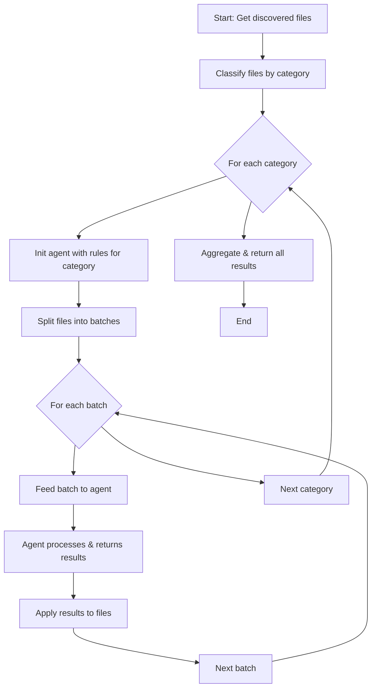
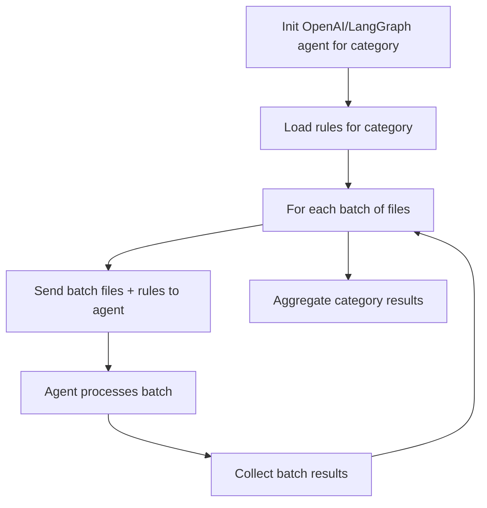

# Agent-Driven Batch File Processing Plan for `_process_discovered_files_with_rules`

## Objective
Patch `_process_discovered_files_with_rules` to:
- Group files by category (using `classify_file`)
- Batch process files per category (default batch size: 3)
- Initialize and use an OpenAI agent (with LangGraph if possible) per category, keeping the agent warm
- Feed the agent rules for the category and files in batches
- Minimize entanglement with current logic

---

## High-Level Steps
1. **Initialize batch size**: Use a parameter (default 3) for batch size.
2. **Classify and group files**: Use `classify_file` to categorize all discovered files.
3. **For each category**:
    - Initialize an OpenAI agent (LangGraph-based if possible) with the rules for that category.
    - Process files in batches (size = batch size):
        - Feed the batch of files and rules to the agent.
        - Collect and apply agent's output (modifications/results).
    - Keep the agent instance warm for all batches in the category.
4. **Aggregate results**: Merge all processing results for return.
5. **Fallback**: If agent or batch processing is not possible, revert to current sequential logic for that category.

---

## Mermaid Diagram: Overall Process

---

## Mermaid Diagram: Agent-Category Detail

---

## Design Notes
- **Agent Initialization**: Instantiate agent per category, keep it warm for batch processing.
- **Batching**: Use a simple loop to split files into batches of size `batch_count` (default 3, configurable).
- **LangGraph**: If available, use to manage agent state and batch workflow; otherwise, use direct OpenAI API calls.
- **Minimal Entanglement**: The new logic should be isolated (e.g., in a helper function/class) and not disrupt the existing sequential fallback.
- **Extensibility**: Easy to adjust batch size or swap agent implementation.

---

## Next Steps
- Validate that LangGraph and OpenAI agent can be integrated in the current environment.
- Prototype category-based batching and agent invocation as a helper.
- The deterministic/agentic file process dispatcher is currently commented out for safety. Once the new batch/agentic approach is tested and validated, we can switch it back on as the default dispatcher.
- Refactor `_process_discovered_files_with_rules` to use the new logic, preserving the fallback.

---

*This plan is a blueprint for implementing agent-driven, batch-based file processing with minimal disruption to the existing workflow. Review and adjust as needed before coding.*
