# Enhanced Database Decommissioning Workflow - Diagram & Description

## Overview

The Enhanced Database Decommissioning Workflow (`concrete/enhanced_db_decommission.py`) is a comprehensive system for safely decommissioning database references across multiple repositories. This workflow integrates advanced pattern discovery, contextual rules processing, and comprehensive logging with visual UI integration.

## Main Workflow Diagram

```mermaid
graph TD
    A[🚀 Enhanced DB Decommission Workflow Start] --> B[📋 Enhanced Environment Validation]
    B --> C[🔄 Enhanced Repository Processing]
    C --> D[🔍 Enhanced Quality Assurance]
    D --> E[📈 Enhanced Workflow Summary]
    E --> F[✅ Workflow Complete]
    
    %% Color coding for implementation status
    classDef implemented fill:#90EE90,stroke:#006400,stroke-width:3px,color:#000
    classDef simplified fill:#FFE4B5,stroke:#FF8C00,stroke-width:2px,color:#000
    classDef mock fill:#FFB6C1,stroke:#DC143C,stroke-width:2px,color:#000
    
    %% Apply colors to main nodes
    class B implemented
    class C implemented
    class D simplified
    class E simplified
    
    %% Start/End nodes
    class A,F implemented
```



## Detailed Sub-Process Diagrams

```mermaid
graph TD
    subgraph SG1["📋 Enhanced Environment Validation (30s)"]
        B1[🔐 Initialize Parameter Service] --> B2[🛠️ Initialize Pattern Discovery Engine]
        B2 --> B3[🏷️ Initialize Source Type Classifier]
        B3 --> B4[⚙️ Initialize Contextual Rules Engine]
        B4 --> B5[📊 Generate Database Patterns]
        B5 --> B6[✅ Validate Environment Ready]
    end
    
    subgraph SG2["🔄 Enhanced Repository Processing (600s)"]
        C1[🌐 Initialize MCP Clients] --> C2[📂 For Each Repository]
        C2 --> C3[📥 Download via Repomix]
        C3 --> C4[🔍 Enhanced Pattern Discovery]
        C4 --> C5{Files Found?}
        C5 -->|Yes| C6[🏷️ Classify File Types]
        C5 -->|No| C7[ℹ️ Log No References]
        C6 --> C8[⚙️ Apply Contextual Rules]
        C8 --> C9[📝 Batch Process Files]
        C9 --> C10[💬 Send Slack Notifications]
        C7 --> C11{More Repos?}
        C10 --> C11
        C11 -->|Yes| C2
        C11 -->|No| C12[📊 Compile Results]
    end
    
    subgraph SG3["🔍 Enhanced Quality Assurance (60s)"]
        D1[✅ Verify DB Reference Removal] --> D2[📋 Validate Rule Compliance]
        D2 --> D3[🛡️ Check Service Integrity]
        D3 --> D4[📊 Generate Quality Score]
        D4 --> D5[💡 Create Recommendations]
    end
    
    subgraph SG4["📈 Enhanced Workflow Summary (30s)"]
        E1[📊 Compile Workflow Metrics] --> E2[📈 Calculate Performance Stats]
        E2 --> E3[📋 Generate Summary Report]
        E3 --> E4[💾 Export Audit Logs]
        E4 --> E5[📱 Update Visual UI]
    end
    
    %% Color coding
    classDef implemented fill:#90EE90,stroke:#006400,stroke-width:2px,color:#000
    classDef simplified fill:#FFE4B5,stroke:#FF8C00,stroke-width:2px,color:#000
    classDef mock fill:#FFB6C1,stroke:#DC143C,stroke-width:2px,color:#000
    
    %% Environment Validation - All implemented
    class B1,B2,B3,B4,B5,B6 implemented
    
    %% Repository Processing - Mix of implemented and simplified
    class C1,C2,C3,C4,C6,C8 implemented
    class C9,C10,C12 simplified
    class C5,C7,C11 implemented
    
    %% Quality Assurance - Mostly simplified
    class D1,D2,D3 simplified
    class D4,D5 simplified
    
    %% Workflow Summary - Mostly simplified  
    class E1,E2 simplified
    class E3,E4,E5 simplified
```



## Workflow Architecture

### Core Components

1. **Centralized Parameter Service** - Manages environment variables and secrets hierarchy
2. **Enhanced Pattern Discovery Engine** - AI-powered database reference detection using Repomix
3. **Source Type Classifier** - Multi-language file type classification
4. **Contextual Rules Engine** - Intelligent, context-aware file processing rules
5. **Comprehensive Workflow Logger** - Detailed logging and metrics collection
6. **Visual Logging Integration** - Real-time UI updates with tables and charts

### Step Dependencies
- `enhanced_validate_environment` → `enhanced_process_repositories` → `enhanced_quality_assurance` → `enhanced_workflow_summary`

## Implementation Status Legend
- 🟢 **Implemented** - Fully functional with real logic and external API calls
- 🟡 **Simplified** - Basic implementation with hardcoded responses/limited logic  
- 🔴 **Mock** - Placeholder functions with no real functionality

## Temporal Ordered Implementation Status

| **Step Order** | **Node** | **Function/Process** | **Parameters** | **Response** | **Description** | **Status** |
|----------------|----------|---------------------|----------------|--------------|-----------------|------------|
| **1.1** | **B1** | `initialize_environment_with_centralized_secrets()` | env_file=".env", secrets_file="secrets.json" | ParameterService instance | Loads environment variables in hierarchy: env vars → .env → secrets.json | 🟢 **Implemented** |
| **1.2** | **B2** | `PatternDiscoveryEngine.__init__()` | None | Engine instance | Initializes pattern discovery with source classifiers | 🟢 **Implemented** |
| **1.3** | **B3** | `SourceTypeClassifier.__init__()` | None | Classifier instance | Initializes multi-language file classification | 🟢 **Implemented** |
| **1.4** | **B4** | `ContextualRulesEngine.__init__()` | None | Rules engine instance | Loads rule definitions for all source types | 🟢 **Implemented** |
| **1.5** | **B5** | `get_database_search_patterns()` | source_type, database_name | List[str] patterns | Generates language-specific search patterns | 🟢 **Implemented** |
| **1.6** | **B6** | Visual logging: environment validation | workflow_id, validation_results | UI table update | Shows component initialization status | 🟢 **Implemented** |
| **2.1** | **C1** | `_initialize_github_client()` | context, workflow_logger | GitHubMCPClient | Initializes GitHub API client with token | 🟢 **Implemented** |
| **2.2** | **C1** | `_initialize_slack_client()` | context, workflow_logger | SlackMCPClient or None | Initializes Slack client with graceful failure | 🟢 **Implemented** |
| **2.3** | **C1** | `_initialize_repomix_client()` | context, workflow_logger | RepomixMCPClient | Initializes Repomix content analysis client | 🟢 **Implemented** |
| **2.4** | **C4** | `enhanced_discover_patterns_step()` | database_name, repo_owner, repo_name | Discovery results dict | Uses Repomix to find database references in code | 🟢 **Implemented** |
| **2.5** | **C4** | `PatternDiscoveryEngine.discover_patterns_in_repository()` | repomix_client, github_client, repo_url, database_name | Pattern matches dict | Analyzes repository content with AI-powered pattern matching | 🟢 **Implemented** |
| **2.6** | **C6** | `SourceTypeClassifier.classify_file()` | file_path, file_content | ClassificationResult | Identifies programming language and frameworks | 🟢 **Implemented** |
| **2.7** | **C8** | `ContextualRulesEngine.process_file_with_contextual_rules()` | file_path, content, classification, database_name | FileProcessingResult | Applies context-aware rules to modify files | 🟢 **Implemented** |
| **2.8** | **C9** | `_process_discovered_files_with_rules()` | discovery_result, database_name, rules_engine | Processing results | Batch processes files with parallel execution | 🟡 **Simplified** |
| **2.9** | **C10** | `_safe_slack_notification()` | slack_client, channel, message | None | Sends notifications with error handling | 🟡 **Simplified** |
| **2.10** | **C4** | Visual logging: pattern discovery | workflow_id, discovery_result | UI tables & sunburst | Shows file matches and type distribution | 🟢 **Implemented** |
| **2.11** | **C12** | Repository results compilation | repo_results, metrics | Results summary | Aggregates processing statistics | 🟡 **Simplified** |
| **3.1** | **D1** | Database reference removal check | database_name, processed_files | Validation result | Verifies no hardcoded references remain | 🟡 **Simplified** |
| **3.2** | **D2** | Rule compliance validation | applied_rules, file_changes | Compliance status | Ensures modifications follow decommissioning rules | 🟡 **Simplified** |
| **3.3** | **D3** | Service integrity check | modified_files, dependencies | Integrity assessment | Validates no critical services broken | 🟡 **Simplified** |
| **3.4** | **D4** | Quality score generation | validation_results | Score (0-100%) | Calculates overall decommissioning quality | 🟡 **Simplified** |
| **3.5** | **D5** | Recommendations creation | issues_found, context | List[str] recommendations | Generates actionable next steps | 🟡 **Simplified** |
| **4.1** | **E1** | Workflow metrics compilation | workflow_logger.metrics | Metrics summary | Aggregates performance and success statistics | 🟡 **Simplified** |
| **4.2** | **E2** | Performance statistics calculation | timing_data, throughput | Performance report | Calculates duration, success rates, throughput | 🟡 **Simplified** |
| **4.3** | **E3** | Summary report generation | all_results, metrics | Summary document | Creates comprehensive workflow summary | 🟡 **Simplified** |
| **4.4** | **E4** | Audit log export | workflow_logger | JSON log file | Exports complete audit trail for compliance | 🟡 **Simplified** |
| **4.5** | **E5** | Visual UI final update | workflow_id, summary | UI dashboard | Updates final summary dashboard | 🟡 **Simplified** |

## Detailed Step Breakdown

### Step 1: Enhanced Environment Validation & Setup
**Function:** `enhanced_validate_environment_step()`
**Timeout:** 30 seconds
**Dependencies:** None

| Sub-Process | Description | Key Features |
|-------------|-------------|--------------|
| **Centralized Parameter Service Init** | Initialize environment with secrets hierarchy | • Environment variables first<br>• .env file overrides<br>• secrets.json final override |
| **Enhanced Components Setup** | Initialize AI-powered components | • Pattern Discovery Engine<br>• Source Type Classifier<br>• Contextual Rules Engine |
| **Database Pattern Generation** | Generate search patterns for target database | • Multi-language patterns<br>• Framework-specific rules<br>• Confidence scoring |
| **Component Validation** | Verify all systems ready | • Health checks<br>• Configuration validation<br>• Error reporting |

**Key Outputs:**
- ✅ Environment readiness status
- 🔧 Component initialization results
- 📊 Pattern generation metrics
- ⚠️ Validation issues (if any)

### Step 2: Enhanced Repository Processing with Pattern Discovery
**Function:** `enhanced_process_repositories_step()`
**Timeout:** 600 seconds (10 minutes)
**Dependencies:** `enhanced_validate_environment`

| Sub-Process | Description | Key Features |
|-------------|-------------|--------------|
| **MCP Client Initialization** | Setup GitHub, Slack, Repomix clients | • GitHub: Repository access<br>• Slack: Real-time notifications<br>• Repomix: Content analysis |
| **Repository Iteration** | Process each target repository | • Parallel processing support<br>• Progress tracking<br>• Error isolation |
| **Enhanced Pattern Discovery** | AI-powered database reference detection | • Repomix content analysis<br>• Multi-pattern matching<br>• Confidence scoring<br>• Framework detection |
| **File Type Classification** | Classify discovered files | • Multi-language support<br>• Framework detection<br>• Source type identification |
| **Contextual Rules Application** | Apply intelligent processing rules | • Context-aware modifications<br>• Batch processing<br>• Validation checks |
| **Visual Logging & Notifications** | Real-time progress updates | • Pattern discovery tables<br>• Sunburst charts<br>• Slack notifications |

**Key Outputs:**
- 📂 Repositories processed count
- 🔍 Files discovered and analyzed
- ✏️ Files modified with changes
- 📊 Pattern discovery results
- 💬 Slack notification delivery
- 📈 Processing metrics

### Step 3: Enhanced Quality Assurance & Validation
**Function:** `enhanced_quality_assurance_step()`
**Timeout:** 60 seconds
**Dependencies:** `enhanced_process_repositories`

| Quality Check | Description | Success Criteria |
|---------------|-------------|------------------|
| **Database Reference Removal** | Verify all database references properly handled | • No hardcoded references remain<br>• Proper replacement patterns applied |
| **Rule Compliance Validation** | Ensure modifications follow decommissioning rules | • Contextual rules correctly applied<br>• No service-breaking changes |
| **Service Integrity Check** | Verify critical services remain functional | • Dependency analysis passed<br>• No broken imports/connections |
| **Pattern Accuracy Assessment** | Validate pattern discovery accuracy | • High-confidence matches verified<br>• False positives minimized |
| **Source Classification Validation** | Confirm file type classification accuracy | • Multi-language detection correct<br>• Framework identification accurate |

**Key Outputs:**
- ✅ Quality score (0-100%)
- 📋 Detailed check results
- ⚠️ Issues identified
- 💡 Recommendations

### Step 4: Enhanced Workflow Summary & Metrics
**Function:** `enhanced_workflow_summary_step()`
**Timeout:** 30 seconds
**Dependencies:** `enhanced_quality_assurance`

| Metric Category | Details | Output Format |
|-----------------|---------|---------------|
| **Processing Summary** | Overall workflow statistics | • Repositories processed<br>• Files discovered/modified<br>• Success rate percentage |
| **Enhancement Features** | AI capabilities utilized | • Pattern discovery accuracy<br>• Rule engine effectiveness<br>• Classification precision |
| **Performance Metrics** | Timing and efficiency data | • Total duration<br>• Per-repository timing<br>• Throughput metrics |
| **Quality Assessment** | Validation results summary | • Quality score<br>• Issues resolved<br>• Recommendations |
| **Log Export** | Comprehensive audit trail | • JSON workflow logs<br>• Visual logging summaries<br>• Metrics dashboard data |

**Key Outputs:**
- 📊 Complete workflow summary
- 📈 Performance metrics
- 📋 Next steps recommendations
- 💾 Exported audit logs

## Enhanced Features & Capabilities

### 🧠 AI-Powered Pattern Discovery
- **Intelligent Pattern Recognition:** Uses Repomix analysis for context-aware database reference detection
- **Multi-Language Support:** Handles SQL, Python, Java, JavaScript, Go, and more
- **Framework Detection:** Recognizes ORM patterns, database libraries, and connection strings
- **Confidence Scoring:** Provides accuracy metrics for each detected reference

### 🏷️ Advanced File Classification
- **Source Type Identification:** Classifies files by programming language and framework
- **Content Analysis:** Examines file contents for accurate classification
- **Database Pattern Matching:** Generates language-specific search patterns
- **Framework-Specific Rules:** Applies targeted processing based on detected frameworks

### ⚙️ Contextual Rules Engine
- **Context-Aware Processing:** Applies different rules based on file type and context
- **Batch Processing:** Efficiently handles multiple files with parallel execution
- **Validation Checks:** Ensures modifications don't break existing functionality
- **Graceful Error Handling:** Continues processing despite individual file errors

### 📊 Comprehensive Logging & Monitoring
- **Workflow Metrics:** Tracks performance, success rates, and processing statistics
- **Visual Integration:** Real-time UI updates with tables, charts, and progress indicators
- **Audit Trail:** Complete JSON logs for compliance and debugging
- **Slack Integration:** Real-time notifications for team awareness

### 🔐 Centralized Security Management
- **Secrets Hierarchy:** Environment variables → .env file → secrets.json
- **Token Management:** Secure handling of GitHub and Slack tokens
- **Validation Pipeline:** Comprehensive security parameter validation
- **Error Isolation:** Graceful handling of missing or invalid credentials

## Configuration Parameters

| Parameter | Default | Description |
|-----------|---------|-------------|
| `database_name` | `"example_database"` | Target database to decommission |
| `target_repos` | `["https://github.com/bprzybys-nc/postgres-sample-dbs"]` | List of repositories to process |
| `slack_channel` | `"C01234567"` | Slack channel for notifications |
| `config_path` | `"mcp_config.json"` | MCP client configuration file |
| `workflow_id` | Auto-generated | Unique identifier for visual logging |

## Error Handling & Recovery

### Graceful Degradation
- **Slack Client Failure:** Workflow continues without notifications
- **Individual Repository Errors:** Other repositories continue processing
- **File Processing Errors:** Batch processing continues with error logging
- **MCP Client Issues:** Fallback mechanisms and retry logic

### Comprehensive Error Reporting
- **Detailed Error Logs:** Full stack traces and context information
- **Visual Error Indicators:** UI updates show error states and recovery actions
- **Metrics Impact:** Error rates tracked in workflow metrics
- **Recovery Recommendations:** Actionable suggestions for issue resolution

## Performance Characteristics

### Scalability
- **Parallel Processing:** Supports concurrent repository and file processing
- **Batch Operations:** Efficient handling of large file sets
- **Memory Management:** Optimized for large repository processing
- **Timeout Controls:** Configurable timeouts prevent hanging operations

### Efficiency Optimizations
- **Enhanced Pattern Discovery:** Reduces false positives and processing overhead
- **Intelligent Caching:** Reuses classification and pattern results
- **Progress Tracking:** Real-time progress updates minimize perceived latency
- **Resource Cleanup:** Proper cleanup of temporary files and connections

## Integration Points

### External Systems
- **GitHub API:** Repository access and file modifications
- **Slack API:** Real-time team notifications
- **Repomix Service:** Advanced content analysis and pattern detection
- **Visual Logging UI:** Real-time workflow visualization

### Internal Dependencies
- **Parameter Service:** Centralized configuration and secrets management
- **Workflow Logger:** Comprehensive audit logging and metrics
- **Rules Engine:** Context-aware file processing logic
- **Source Classifier:** Multi-language file type identification

## Usage Examples

### Basic Usage
```python
workflow = create_enhanced_db_decommission_workflow(
    database_name="legacy_analytics",
    target_repos=["https://github.com/company/analytics-service"],
    slack_channel="#database-ops"
)
result = await workflow.execute()
```

### Advanced Configuration
```python
workflow = create_enhanced_db_decommission_workflow(
    database_name="user_profiles",
    target_repos=[
        "https://github.com/company/user-service",
        "https://github.com/company/auth-service",
        "https://github.com/company/reporting-service"
    ],
    slack_channel="#critical-ops",
    config_path="production_mcp_config.json"
)
result = await workflow.execute()
```

This enhanced workflow represents a significant advancement over traditional database decommissioning approaches, providing AI-powered intelligence, comprehensive logging, and robust error handling for enterprise-scale operations. 