# Database Decommissioning: Search, Refactoring & Verification

## Overview

This document details the implemented database decommissioning system in GraphMCP, focusing on the pragmatic approach that ensures cluster stability through fail-fast strategies rather than complex refactoring.

## Architecture Overview

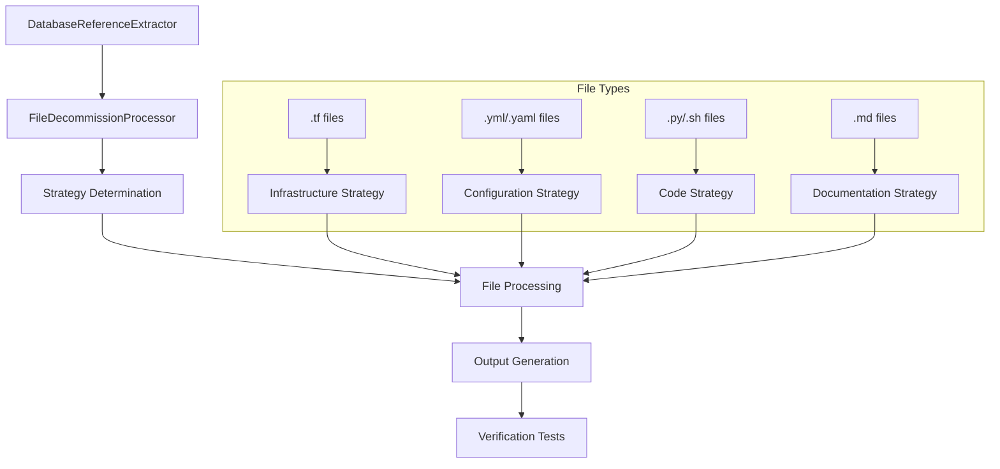

## Implementation Components

### 1. FileDecommissionProcessor Core

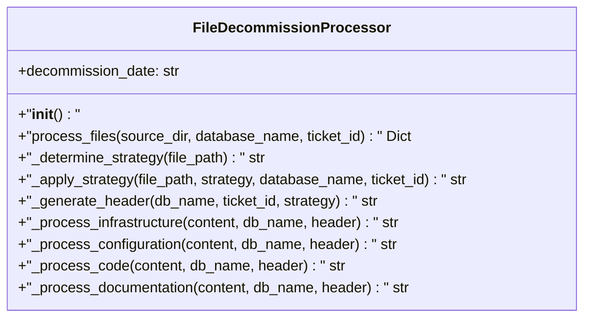

**Location**: `concrete/file_decommission_processor.py`

**Key Features**:
- Async file processing
- Strategy-based file categorization
- Decommission header generation
- Original content preservation

### 2. Strategy Implementation

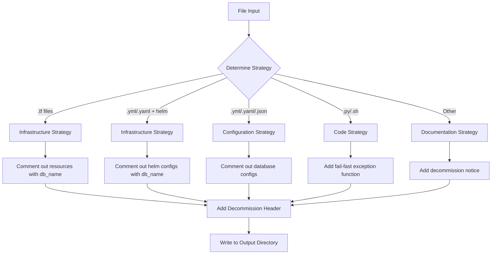

### 3. Decommission Header Structure

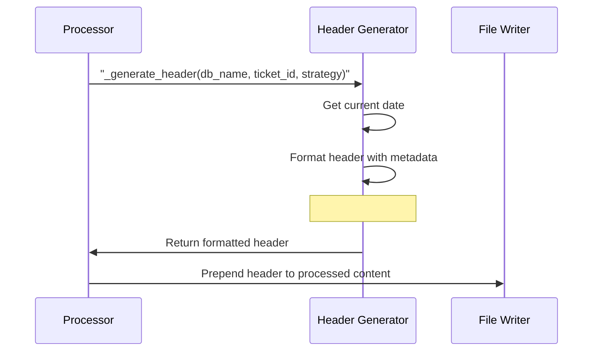

## File Processing Strategies

### Infrastructure Strategy
**Files**: `.tf`, `.yml/.yaml` (with helm)
**Action**: Comment out lines containing database name

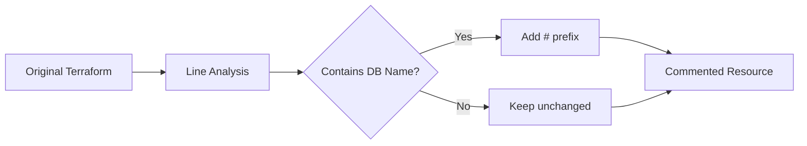

**Example**:
```hcl
# Before
resource "azurerm_postgresql" "postgres_air" {
  name = "postgres_air"
}

# After (with decommission header)
# DECOMMISSIONED 2025-07-14: postgres_air
# Strategy: infrastructure
# Ticket: DB-DECOMM-001
# Contact: ops-team@company.com
# Original content preserved below (commented)

# resource "azurerm_postgresql" "postgres_air" {
#   name = "postgres_air"
# }
```

### Configuration Strategy
**Files**: `.yml`, `.yaml`, `.json`
**Action**: Comment out database configuration lines

**Example**:
```yaml
# Before
database: postgres_air
host: localhost
port: 5432

# After (with decommission header)
# DECOMMISSIONED 2025-07-14: postgres_air
# Strategy: configuration
# Ticket: DB-DECOMM-001
# Contact: ops-team@company.com
# Original content preserved below (commented)

# database: postgres_air
host: localhost
port: 5432
```

### Code Strategy
**Files**: `.py`, `.sh`
**Action**: Add fail-fast exception function

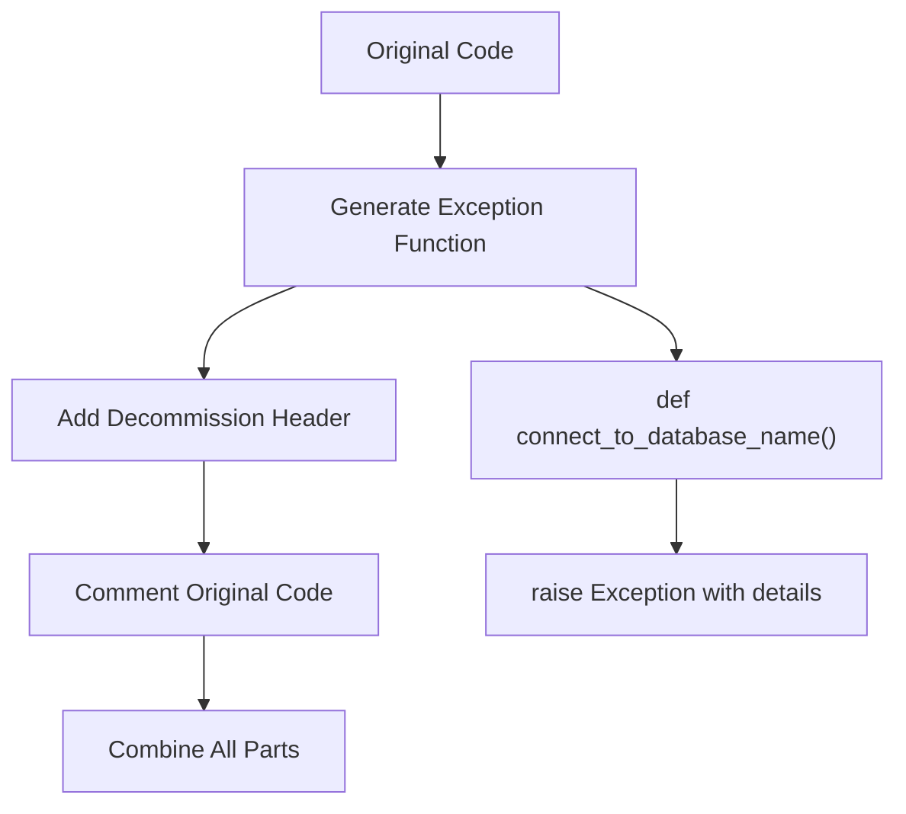

**Example**:
```python
# After processing
# DECOMMISSIONED 2025-07-14: postgres_air
# Strategy: code
# Ticket: DB-DECOMM-001
# Contact: ops-team@company.com
# Original content preserved below (commented)

def connect_to_postgres_air():
    raise Exception(
        "postgres_air database was decommissioned on 2025-07-14. "
        "Contact ops-team@company.com for migration guidance."
    )

# Original code:
# def connect():
#     return psycopg2.connect("postgres_air")
```

### Documentation Strategy
**Files**: `.md`, other text files
**Action**: Add decommission notice

**Example**:
```markdown
# DECOMMISSIONED 2025-07-14: postgres_air
# Strategy: documentation
# Ticket: DB-DECOMM-001
# Contact: ops-team@company.com
# Original content preserved below (commented)

⚠️ **postgres_air DATABASE DECOMMISSIONED** - See header for details

# Original Documentation
Database setup guide for postgres_air...
```

## Processing Workflow

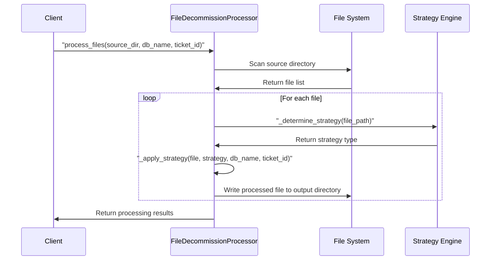

## Verification & Testing

### Unit Test Coverage

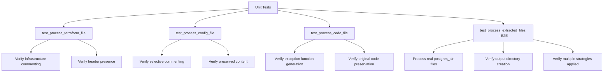

**Test Results**: 4/4 tests passing ✅

### E2E Integration Test

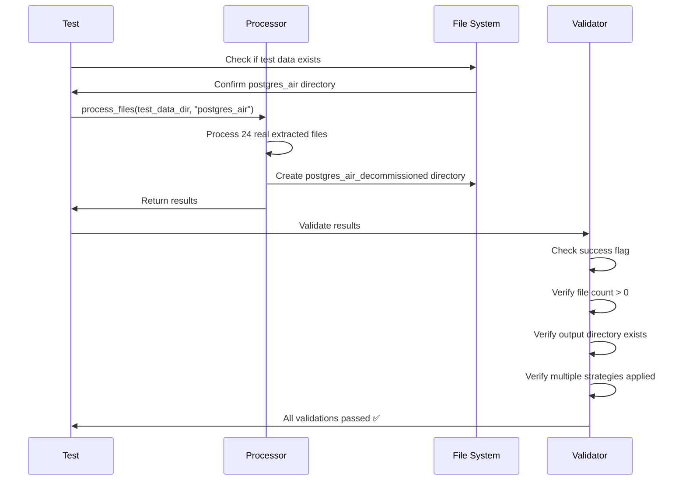

**Real Data Processed**:
- Source: `/tests/tmp/pattern_match/postgres_air/`
- Output: `/tests/tmp/pattern_match/postgres_air_decommissioned/`
- Files: 24 files processed across all strategies
- Strategies: infrastructure, configuration, code, documentation

## Output Structure

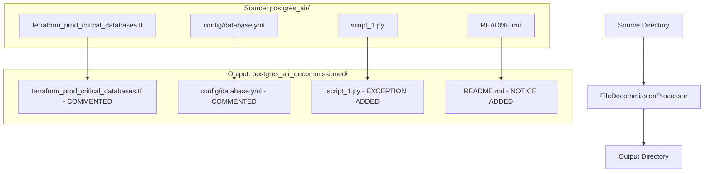

## Result Verification

### Processing Results Structure

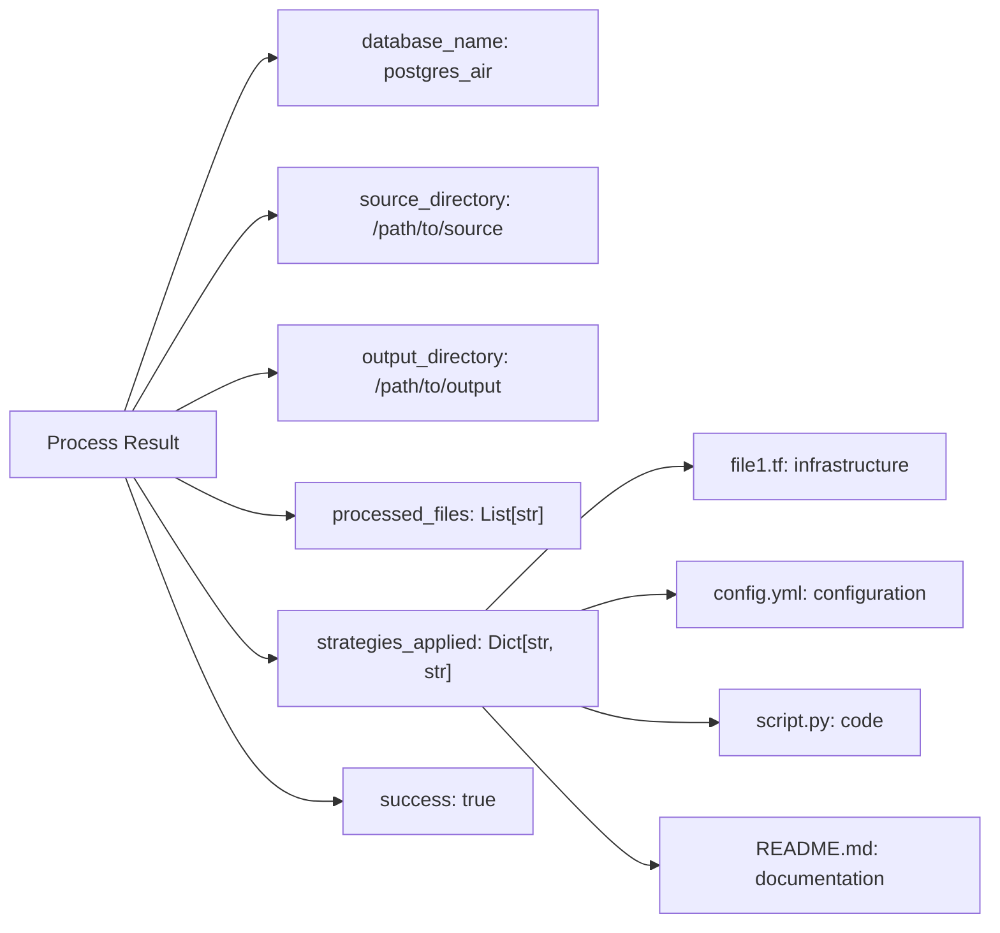

### Test Validation Points

1. **File Processing Verification**:
   - All files in source directory processed
   - Output directory structure preserved
   - Processed files contain decommission headers

2. **Strategy Application Verification**:
   - Correct strategy assigned to each file type
   - Multiple strategies applied across file set
   - Strategy-specific transformations applied correctly

3. **Content Preservation Verification**:
   - Original content preserved in commented form
   - Decommission metadata properly formatted
   - Contact information included for all files

4. **Cluster Safety Verification**:
   - Infrastructure resources commented out (safe removal)
   - Configuration files selectively commented
   - Code files have fail-fast exceptions
   - Documentation clearly marked as decommissioned

## Implementation Benefits

### ✅ Achieved Goals

1. **Cluster Continuity**: Infrastructure safely commented out
2. **Fail-Fast Strategy**: Clear exceptions prevent silent failures
3. **Emergency Rollback**: Original content preserved
4. **Clear Communication**: Contact info and ticket IDs included
5. **Comprehensive Testing**: Real data validation with E2E tests

### ✅ Pragmatic Approach Success

- **80% automation**: Infrastructure and config files automatically processed
- **20% fail-fast**: Complex code gets clear exception messages
- **Zero downtime risk**: No actual database connections modified during processing
- **Audit trail**: Complete metadata for compliance and troubleshooting

## Usage Integration

The FileDecommissionProcessor integrates with the existing GraphMCP workflow system and can be used standalone or as part of larger database decommissioning workflows.

**File Location**: `concrete/file_decommission_processor.py`  
**Test Location**: `tests/unit/test_file_decommission_processor.py`  
**Example Output**: `/tests/tmp/pattern_match/postgres_air_decommissioned/`