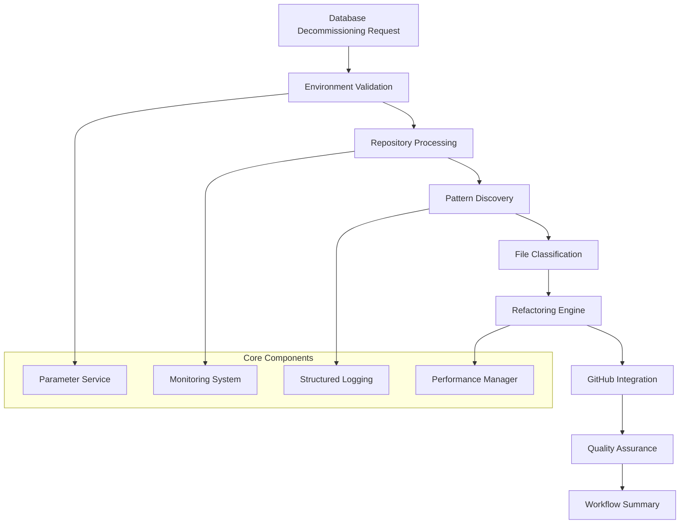
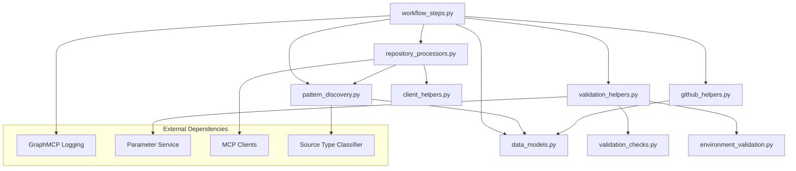
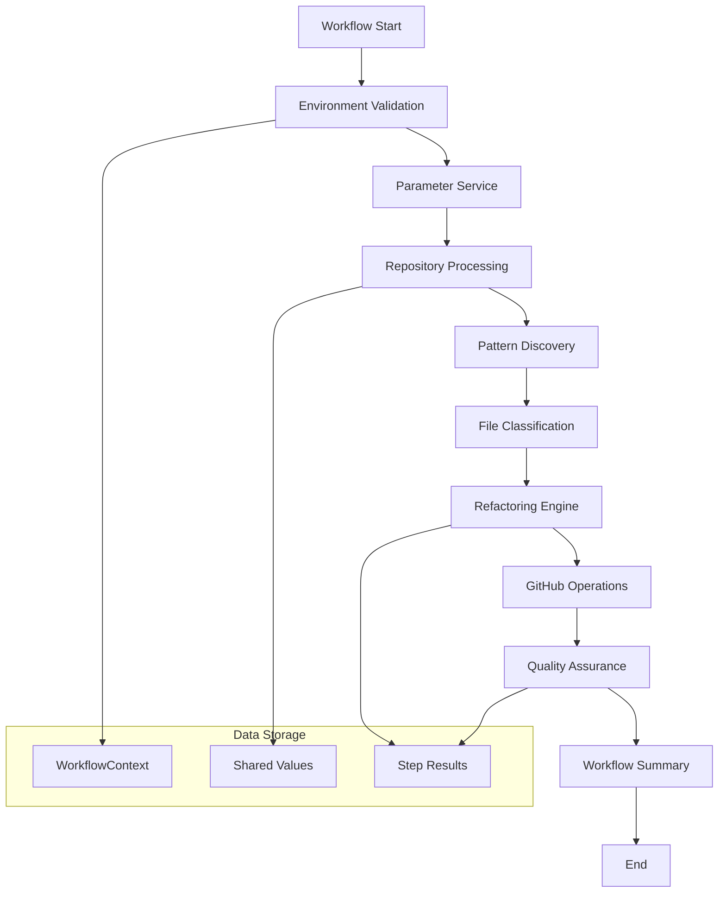
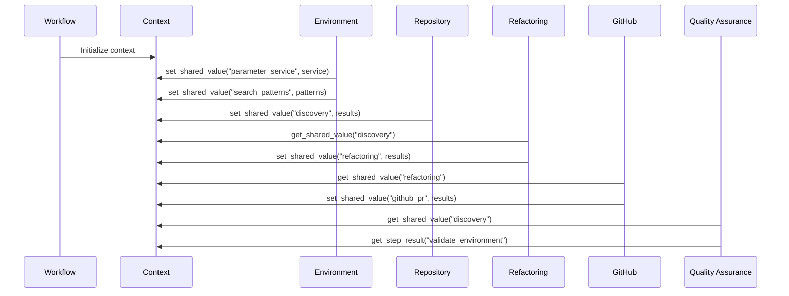

# Database Decommissioning Workflow System

## 📋 Table of Contents

1. [Overview](#overview)
2. [Architecture](#architecture)
3. [Module Structure](#module-structure)
4. [Workflow Steps](#workflow-steps)
5. [Data Flow](#data-flow)
6. [Configuration](#configuration)
7. [Error Handling](#error-handling)
8. [Best Practices](#best-practices)
9. [Troubleshooting](#troubleshooting)
10. [Examples](#examples)

---

## Overview

The Database Decommissioning Workflow System is a comprehensive, modular solution for safely removing database references from codebases. It follows GraphMCP patterns and implements structured logging, async-first design, and comprehensive error handling.

### Key Features

- **Modular Architecture**: Each module < 500 lines, single responsibility
- **Structured Logging**: JSON-first logging with console output
- **Async-First**: All operations are asynchronous
- **Error Resilience**: Comprehensive error handling and recovery
- **Pattern Discovery**: AI-powered database reference detection
- **Quality Assurance**: Multi-level validation and confidence scoring

### System Overview



---

## Architecture

### High-Level Architecture

The system follows a layered architecture with clear separation of concerns:

```
┌─────────────────────────────────────────────────────────────┐
│                    Workflow Orchestration                   │
├─────────────────────────────────────────────────────────────┤
│  validate_environment │ process_repositories │ apply_refactoring │
│  create_github_pr     │ quality_assurance    │ workflow_summary  │
├─────────────────────────────────────────────────────────────┤
│                    Business Logic Layer                     │
├─────────────────────────────────────────────────────────────┤
│  Pattern Discovery    │ Repository Processing │ GitHub Helpers │
│  Validation Checks    │ Client Helpers        │ Data Models    │
├─────────────────────────────────────────────────────────────┤
│                    Infrastructure Layer                     │
├─────────────────────────────────────────────────────────────┤
│  Structured Logging   │ Parameter Service    │ Monitoring     │
│  Performance Manager  │ MCP Clients          │ Error Handling │
└─────────────────────────────────────────────────────────────┘
```

### Design Principles

1. **Modularity**: Each component has a single responsibility
2. **Async-First**: All I/O operations are asynchronous
3. **Structured Logging**: JSON-first logging with human-readable console output
4. **Error Resilience**: Comprehensive error handling and recovery
5. **Testability**: Components are designed for easy unit testing

---

## Module Structure

### Core Modules

| Module | Purpose | Key Components |
|--------|---------|----------------|
| `workflow_steps.py` | Main workflow step implementations | `quality_assurance_step()`, `apply_refactoring_step()` |
| `data_models.py` | Data structures and models | `FileProcessingResult`, `QualityAssuranceResult` |
| `pattern_discovery.py` | Pattern discovery and AI processing | `AgenticFileProcessor`, `categorize_files_by_source_type()` |
| `repository_processors.py` | Repository-level processing | `process_single_repository()`, `process_repositories_step()` |
| `validation_helpers.py` | Environment and setup validation | `validate_environment_step()`, `perform_database_reference_check()` |
| `utils.py` | Utility functions and workflow creation | `create_db_decommission_workflow()`, `run_decommission()` |

### Helper Modules

| Module | Purpose | Key Components |
|--------|---------|----------------|
| `client_helpers.py` | MCP client initialization and management | `initialize_github_client()`, `send_slack_notification_with_retry()` |
| `github_helpers.py` | GitHub-specific operations | `create_fork_and_branch()`, `create_pull_request()` |
| `validation_checks.py` | Specific validation implementations | `perform_rule_compliance_check()`, `perform_service_integrity_check()` |
| `environment_validation.py` | Environment validation functions | `perform_environment_validation()` |

### Module Dependencies



---

## Workflow Steps

### 1. Environment Validation

**Purpose**: Validate environment setup and initialize components

**Key Operations**:
- Initialize parameter service
- Validate monitoring system
- Test database reference extractor
- Verify file decommission processor
- Validate source type classifier

**Success Criteria**:
- All components initialized successfully
- No critical validation failures
- Search patterns generated

```python
async def validate_environment_step(
    context: Any,
    step: Any,
    database_name: str = "example_database",
    workflow_id: Optional[str] = None
) -> Dict[str, Any]:
    # Implementation details in workflow_steps.py
```

### 2. Repository Processing

**Purpose**: Process repositories with pattern discovery

**Key Operations**:
- Initialize MCP clients (GitHub, Slack, Repomix)
- Pack repositories using Repomix
- Extract database references
- Log pattern discovery results
- Send Slack notifications

**Success Criteria**:
- All repositories processed successfully
- Pattern discovery completed
- Files categorized by type

```python
async def process_repositories_step(
    context: Any,
    step: Any,
    target_repos: List[str],
    database_name: str = "example_database",
    slack_channel: str = "#database-decommission",
    workflow_id: Optional[str] = None
) -> Dict[str, Any]:
    # Implementation details in workflow_steps.py
```

### 3. Apply Refactoring

**Purpose**: Apply contextual refactoring rules to discovered files

**Key Operations**:
- Use FileDecommissionProcessor for file processing
- Apply strategy-based refactoring
- Create modified file versions
- Track changes and statistics

**Success Criteria**:
- Files processed according to strategy
- Changes tracked and logged
- Modified content available for commit

### 4. Create GitHub PR

**Purpose**: Create GitHub pull request with changes

**Key Operations**:
- Fork repository
- Create feature branch
- Commit modified files
- Create pull request with detailed description

**Success Criteria**:
- Fork and branch created successfully
- All modified files committed
- Pull request created with comprehensive description

### 5. Quality Assurance

**Purpose**: Perform comprehensive quality checks

**Key Operations**:
- Database reference check
- Rule compliance validation
- Service integrity assessment
- Generate recommendations

**Success Criteria**:
- All quality checks pass or have acceptable warnings
- Quality score above threshold
- Recommendations generated

### 6. Workflow Summary

**Purpose**: Generate comprehensive workflow summary

**Key Operations**:
- Collect metrics from all steps
- Calculate success rates
- Generate final report
- Export logs

**Success Criteria**:
- All metrics calculated
- Summary report generated
- Logs exported successfully

---

## Data Flow

### Overall Data Flow



### Data Models

| Model | Purpose | Key Fields |
|-------|---------|------------|
| `FileProcessingResult` | Individual file processing outcome | `file_path`, `source_type`, `success`, `total_changes` |
| `QualityAssuranceResult` | QA check results | `database_reference_check`, `rule_compliance_check`, `service_integrity_check` |
| `WorkflowStepResult` | Step execution result | `step_name`, `success`, `duration_seconds`, `result_data` |
| `DecommissioningSummary` | Overall workflow summary | `total_files_processed`, `successful_files`, `execution_time_seconds` |

### Context Data Flow



---

## Configuration

### Environment Variables

| Variable | Purpose | Default | Required |
|----------|---------|---------|----------|
| `GITHUB_PERSONAL_ACCESS_TOKEN` | GitHub API access | None | Yes |
| `SLACK_BOT_TOKEN` | Slack notifications | None | Optional |
| `OPENAI_API_KEY` | AI-powered processing | None | Optional |
| `LOG_LEVEL` | Logging level | INFO | No |
| `LOG_FILE` | Log file path | dbworkflow.log | No |

### MCP Configuration

```json
{
  "mcpServers": {
    "ovr_github": {
      "command": "npx",
      "args": ["@modelcontextprotocol/server-github"],
      "env": {
        "GITHUB_PERSONAL_ACCESS_TOKEN": "$GITHUB_PERSONAL_ACCESS_TOKEN"
      }
    },
    "ovr_slack": {
      "command": "npx",
      "args": ["@modelcontextprotocol/server-slack"],
      "env": {
        "SLACK_BOT_TOKEN": "$SLACK_BOT_TOKEN"
      }
    },
    "ovr_repomix": {
      "command": "npx",
      "args": ["repomix", "--mcp"]
    }
  }
}
```

### Workflow Configuration

```python
workflow_config = {
    "max_parallel_steps": 4,
    "default_timeout": 120,
    "stop_on_error": False,
    "default_retry_count": 3
}
```

---

## Error Handling

### Error Categories

| Category | Description | Handling Strategy |
|----------|-------------|-------------------|
| **Validation Errors** | Environment setup failures | Fail fast, detailed error messages |
| **Network Errors** | MCP client connectivity issues | Retry with exponential backoff |
| **Processing Errors** | File processing failures | Continue processing, log failures |
| **GitHub Errors** | Repository operations failures | Retry with different strategies |
| **Quality Errors** | QA check failures | Generate warnings, continue workflow |

### Error Handling Patterns

```python
# Comprehensive error handling with structured logging
try:
    result = await process_operation()
    logger.log_info("Operation completed successfully")
    return result
except SpecificError as e:
    logger.log_error("Specific operation failed", e)
    # Attempt recovery
    return await fallback_operation()
except Exception as e:
    logger.log_error("Unexpected error occurred", e)
    raise
```

### Retry Strategies

```python
async def send_slack_notification_with_retry(
    slack_client: Any,
    channel: str,
    message: str,
    max_retries: int = 3
) -> bool:
    for attempt in range(max_retries):
        try:
            await slack_client.send_message(channel, message)
            return True
        except Exception as e:
            if attempt == max_retries - 1:
                logger.log_error(f"Failed after {max_retries} attempts")
                return False
            await asyncio.sleep(2 ** attempt)  # Exponential backoff
    return False
```

---

## Best Practices

### 1. Module Design

**✅ DO:**
- Keep modules under 500 lines
- Use single responsibility principle
- Implement async-first patterns
- Include comprehensive type hints

**❌ DON'T:**
- Mix concerns in single module
- Use blocking synchronous operations
- Ignore error handling
- Skip documentation

### 2. Error Handling

**✅ DO:**
- Use structured logging for all errors
- Implement appropriate retry strategies
- Provide meaningful error messages
- Log context information

**❌ DON'T:**
- Suppress exceptions silently
- Use generic error messages
- Ignore transient failures
- Skip error context

### 3. Data Flow

**✅ DO:**
- Use WorkflowContext for data sharing
- Validate data at module boundaries
- Use typed data models
- Implement proper serialization

**❌ DON'T:**
- Use global variables
- Pass raw dictionaries between modules
- Skip data validation
- Ignore type safety

### 4. Performance

**✅ DO:**
- Use async/await for I/O operations
- Implement batching for bulk operations
- Use connection pooling
- Monitor performance metrics

**❌ DON'T:**
- Block on I/O operations
- Process files one by one
- Create new connections repeatedly
- Ignore performance bottlenecks

---

## Anti-Patterns

### Common Anti-Patterns to Avoid

| Anti-Pattern | Problem | Solution |
|--------------|---------|----------|
| **Monolithic Functions** | Single function > 100 lines | Break into smaller, focused functions |
| **Deep Nesting** | Complex nested if/try blocks | Use early returns and guard clauses |
| **Magic Numbers** | Hardcoded values without context | Use named constants or configuration |
| **Silent Failures** | Errors caught but not logged | Always log errors with context |
| **Synchronous I/O** | Blocking operations | Use async/await patterns |

### Example: Refactoring Anti-Pattern

**❌ Bad:**
```python
def process_files(files):
    for file in files:
        try:
            content = read_file(file)  # Blocking I/O
            if "database" in content:
                if file.endswith(".py"):
                    result = process_python_file(content)
                elif file.endswith(".js"):
                    result = process_js_file(content)
                # ... more nested conditions
        except:
            pass  # Silent failure
```

**✅ Good:**
```python
async def process_files(files: List[str], processor: FileProcessor) -> List[FileProcessingResult]:
    results = []
    for file_path in files:
        try:
            result = await processor.process_file(file_path)
            results.append(result)
        except Exception as e:
            logger.log_error(f"Failed to process {file_path}", e)
            results.append(FileProcessingResult(
                file_path=file_path,
                success=False,
                error_message=str(e)
            ))
    return results
```

---

## Troubleshooting

### Common Issues

#### 1. Environment Validation Failures

**Symptom**: Validation step fails with component initialization errors

**Causes**:
- Missing environment variables
- Invalid credentials
- Network connectivity issues
- Service unavailability

**Solutions**:
```bash
# Check environment variables
echo $GITHUB_PERSONAL_ACCESS_TOKEN
echo $SLACK_BOT_TOKEN

# Test network connectivity
curl -I https://api.github.com

# Validate credentials
gh auth status
```

#### 2. Repository Processing Failures

**Symptom**: Repository processing step fails or times out

**Causes**:
- Large repository size
- Network timeouts
- Insufficient permissions
- Rate limiting

**Solutions**:
```python
# Increase timeout
.custom_step(
    "process_repositories",
    "Repository Processing",
    process_repositories_step,
    timeout_seconds=1200  # Increase from 600
)

# Implement rate limiting
await asyncio.sleep(1)  # Between API calls
```

#### 3. Pattern Discovery Issues

**Symptom**: Few or no patterns discovered

**Causes**:
- Incorrect database name
- Overly restrictive patterns
- File type classification issues
- Content encoding problems

**Solutions**:
```python
# Expand search patterns
search_patterns = [
    rf'\b{re.escape(database_name)}\b',
    rf'["\']?{re.escape(database_name)}["\']?',
    rf'{re.escape(database_name)}\.',
    rf'_{re.escape(database_name)}_'
]

# Debug pattern matching
logger.log_info(f"Searching for patterns: {search_patterns}")
```

#### 4. GitHub Integration Problems

**Symptom**: Fork creation or PR creation fails

**Causes**:
- Insufficient GitHub permissions
- Repository already forked
- Branch naming conflicts
- API rate limiting

**Solutions**:
```python
# Check existing fork
try:
    existing_fork = await github_client.get_fork(repo_owner, repo_name)
    if existing_fork:
        fork_owner = existing_fork["owner"]["login"]
        logger.log_info(f"Using existing fork: {fork_owner}/{repo_name}")
except:
    # Create new fork
    fork_result = await github_client.fork_repository(repo_owner, repo_name)
```

### Debugging Tools

#### 1. Logging Analysis

```bash
# Filter logs by level
grep "ERROR" dbworkflow.log | jq '.'

# Check specific step logs
grep "process_repositories" dbworkflow.log | jq '.step_name, .success, .duration'

# Monitor workflow progress
tail -f dbworkflow.log | jq '.timestamp, .message'
```

#### 2. Performance Monitoring

```python
# Add performance metrics
import time
start_time = time.time()
result = await operation()
duration = time.time() - start_time
logger.log_info(f"Operation completed in {duration:.2f}s")
```

#### 3. Context Inspection

```python
# Debug context values
logger.log_info(f"Context keys: {list(context._shared_values.keys())}")
logger.log_info(f"Discovery result: {context.get_shared_value('discovery', {})}")
```

---

## Examples

### Basic Usage

```python
import asyncio
from concrete.db_decommission.utils import run_decommission

async def main():
    result = await run_decommission(
        database_name="postgres_air",
        target_repos=["https://github.com/user/repo"],
        slack_channel="#database-decommission"
    )
    print(f"Workflow completed with status: {result.status}")

asyncio.run(main())
```

### Custom Workflow Configuration

```python
from concrete.db_decommission.utils import create_db_decommission_workflow

workflow = create_db_decommission_workflow(
    database_name="legacy_db",
    target_repos=[
        "https://github.com/org/service-1",
        "https://github.com/org/service-2"
    ],
    slack_channel="#database-migrations",
    config_path="custom_mcp_config.json"
)

# Execute with custom configuration
result = await workflow.execute()
```

### Testing Individual Components

```python
from concrete.db_decommission.pattern_discovery import AgenticFileProcessor
from concrete.source_type_classifier import SourceTypeClassifier

# Test pattern discovery
classifier = SourceTypeClassifier()
processor = AgenticFileProcessor(
    source_classifier=classifier,
    contextual_rules_engine=rules_engine,
    github_client=github_client,
    repo_owner="test",
    repo_name="test"
)

files = [
    {"file_path": "test.py", "file_content": "# Test content"}
]
results = await processor.process_files(files)
```

### Advanced Error Handling

```python
from concrete.db_decommission.workflow_steps import validate_environment_step

try:
    validation_result = await validate_environment_step(
        context=workflow_context,
        step=step_config,
        database_name="test_db"
    )
    
    if not validation_result["success"]:
        logger.log_error("Environment validation failed", 
                        context=validation_result)
        # Implement recovery strategy
        
except Exception as e:
    logger.log_error("Critical validation error", e)
    # Implement emergency fallback
```

---

## Conclusion

This documentation provides a comprehensive guide to understanding, maintaining, and extending the Database Decommissioning Workflow System. The modular architecture, structured logging, and comprehensive error handling make it suitable for production use while maintaining developer productivity.

For additional questions or support, refer to the individual module documentation or contact the development team.

---

**Last Updated**: July 15, 2025  
**Version**: 2.0  
**Author**: Database Decommissioning Team