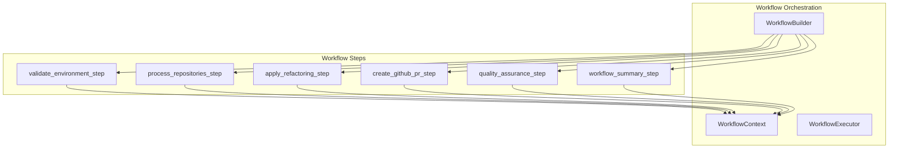
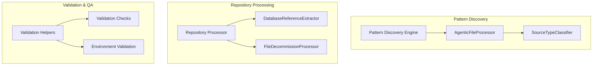
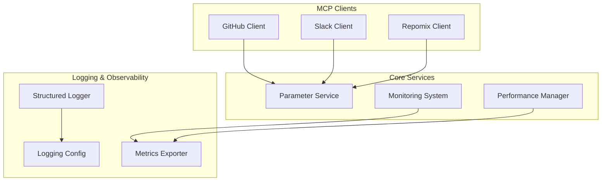
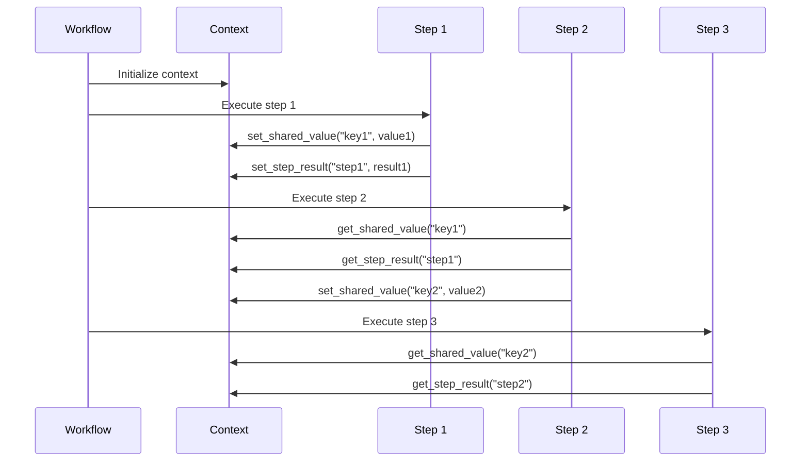
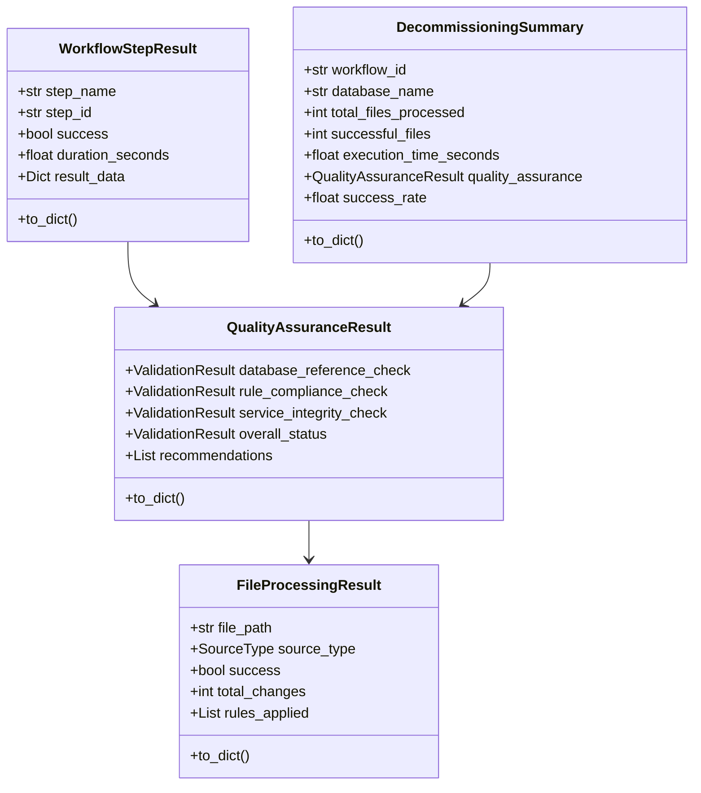
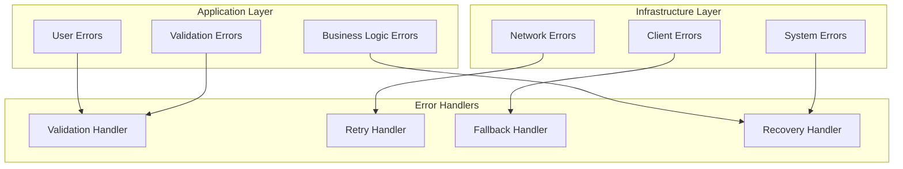

# Architecture Guide: Database Decommissioning Workflow

## Overview

This document provides a deep-dive into the architectural decisions, patterns, and design principles of the Database Decommissioning Workflow System.

## Core Architecture Principles

### 1. Modular Design

The system is designed with strict modularity to ensure maintainability and testability:

```
concrete/db_decommission/
├── __init__.py                 # Package initialization
├── workflow_steps.py          # Main workflow step implementations
├── data_models.py             # Data structures and models
├── pattern_discovery.py       # AI-powered pattern discovery
├── repository_processors.py   # Repository-level processing
├── validation_helpers.py      # Environment validation
├── utils.py                   # Utility functions
├── client_helpers.py          # MCP client management
├── github_helpers.py          # GitHub-specific operations
├── validation_checks.py       # QA validation implementations
└── environment_validation.py  # Environment setup validation
```

### 2. Async-First Architecture

All operations are designed to be asynchronous to maximize throughput and responsiveness:

```python
# Example: Async workflow step
async def process_repositories_step(
    context: Any,
    step: Any,
    target_repos: List[str],
    database_name: str = "example_database"
) -> Dict[str, Any]:
    # Async operations throughout
    github_client = await initialize_github_client(context, logger)
    results = await asyncio.gather(*[
        process_single_repository(repo) for repo in target_repos
    ])
    return compile_results(results)
```

### 3. Structured Logging

Comprehensive logging with both JSON and console output:

```python
from graphmcp.logging import get_logger
from graphmcp.logging.config import LoggingConfig

# Initialize structured logger
config = LoggingConfig.from_env()
logger = get_logger(workflow_id=f"db_decommission_{database_name}", config=config)

# Log with structured data
logger.log_step_start(
    "process_repositories",
    "Processing repositories with pattern discovery",
    {"database_name": database_name, "repo_count": len(target_repos)}
)
```

## Component Architecture

### 1. Workflow Orchestration Layer



**Key Components:**
- `WorkflowBuilder`: Constructs workflow with steps and dependencies
- `WorkflowContext`: Manages shared state between steps
- `WorkflowExecutor`: Executes steps in correct order with error handling

### 2. Business Logic Layer



**Key Components:**
- **Pattern Discovery**: AI-powered detection of database references
- **Repository Processing**: Bulk repository operations and file processing
- **Validation & QA**: Comprehensive validation and quality assurance

### 3. Infrastructure Layer



**Key Components:**
- **MCP Clients**: External service integration
- **Core Services**: Parameter management, monitoring, performance
- **Logging & Observability**: Structured logging and metrics

## Data Flow Architecture

### 1. Context-Based Data Sharing



### 2. Data Model Hierarchy



## Error Handling Architecture

### 1. Layered Error Handling



### 2. Error Recovery Patterns

```python
# Pattern 1: Retry with exponential backoff
async def with_retry(operation, max_retries=3):
    for attempt in range(max_retries):
        try:
            return await operation()
        except RetryableError as e:
            if attempt == max_retries - 1:
                raise
            await asyncio.sleep(2 ** attempt)

# Pattern 2: Circuit breaker
class CircuitBreaker:
    def __init__(self, failure_threshold=5, timeout=60):
        self.failure_threshold = failure_threshold
        self.timeout = timeout
        self.failure_count = 0
        self.last_failure_time = None
        self.state = "CLOSED"  # CLOSED, OPEN, HALF_OPEN
    
    async def call(self, operation):
        if self.state == "OPEN":
            if time.time() - self.last_failure_time > self.timeout:
                self.state = "HALF_OPEN"
            else:
                raise CircuitBreakerOpen()
        
        try:
            result = await operation()
            self.failure_count = 0
            self.state = "CLOSED"
            return result
        except Exception as e:
            self.failure_count += 1
            self.last_failure_time = time.time()
            
            if self.failure_count >= self.failure_threshold:
                self.state = "OPEN"
            
            raise

# Pattern 3: Graceful degradation
async def process_with_fallback(primary_operation, fallback_operation):
    try:
        return await primary_operation()
    except Exception as e:
        logger.log_warning(f"Primary operation failed: {e}")
        logger.log_info("Attempting fallback operation")
        return await fallback_operation()
```

## Performance Architecture

### 1. Async Processing Patterns

```python
# Pattern 1: Concurrent processing
async def process_repositories_concurrent(repos):
    semaphore = asyncio.Semaphore(5)  # Limit concurrent operations
    
    async def process_single_repo(repo):
        async with semaphore:
            return await process_repository(repo)
    
    results = await asyncio.gather(*[
        process_single_repo(repo) for repo in repos
    ])
    return results

# Pattern 2: Streaming processing
async def process_files_streaming(files):
    async def file_generator():
        for file in files:
            yield await process_file(file)
    
    results = []
    async for result in file_generator():
        results.append(result)
        if len(results) % 100 == 0:
            logger.log_info(f"Processed {len(results)} files")
    
    return results
```

### 2. Caching Strategy

```python
from functools import lru_cache
import asyncio

class AsyncLRUCache:
    def __init__(self, maxsize=128):
        self.cache = {}
        self.maxsize = maxsize
        self.access_order = []
    
    async def get(self, key, factory_func):
        if key in self.cache:
            self.access_order.remove(key)
            self.access_order.append(key)
            return self.cache[key]
        
        value = await factory_func()
        self.cache[key] = value
        self.access_order.append(key)
        
        if len(self.cache) > self.maxsize:
            oldest_key = self.access_order.pop(0)
            del self.cache[oldest_key]
        
        return value

# Usage
cache = AsyncLRUCache(maxsize=100)

async def get_repository_info(repo_url):
    return await cache.get(repo_url, lambda: fetch_repository_info(repo_url))
```

## Testing Architecture

### 1. Test Structure

```
tests/
├── unit/
│   ├── test_workflow_steps.py
│   ├── test_data_models.py
│   ├── test_pattern_discovery.py
│   └── test_validation_helpers.py
├── integration/
│   ├── test_workflow_integration.py
│   ├── test_github_integration.py
│   └── test_mcp_clients.py
└── e2e/
    ├── test_full_workflow.py
    └── test_performance.py
```

### 2. Test Patterns

```python
# Unit test pattern
import pytest
from unittest.mock import AsyncMock, Mock
from concrete.db_decommission.workflow_steps import validate_environment_step

@pytest.mark.asyncio
async def test_validate_environment_step_success():
    # Arrange
    context = Mock()
    step = Mock()
    logger = Mock()
    
    # Act
    result = await validate_environment_step(
        context=context,
        step=step,
        database_name="test_db"
    )
    
    # Assert
    assert result["success"] is True
    assert result["database_name"] == "test_db"
    assert "search_patterns" in result

# Integration test pattern
@pytest.mark.integration
async def test_github_integration():
    # Test with real GitHub client
    github_client = GitHubMCPClient()
    
    # Test fork creation
    fork_result = await github_client.fork_repository("test-org", "test-repo")
    assert fork_result["success"] is True
    
    # Cleanup
    await github_client.delete_repository(fork_result["owner"], "test-repo")
```

## Security Architecture

### 1. Credential Management

```python
from concrete.parameter_service import get_parameter_service

class SecureCredentialManager:
    def __init__(self):
        self.param_service = get_parameter_service()
    
    async def get_github_token(self):
        return await self.param_service.get_parameter(
            "GITHUB_PERSONAL_ACCESS_TOKEN",
            decrypt=True
        )
    
    async def get_slack_token(self):
        return await self.param_service.get_parameter(
            "SLACK_BOT_TOKEN",
            decrypt=True
        )
```

### 2. Input Validation

```python
from pydantic import BaseModel, validator

class RepositoryInput(BaseModel):
    url: str
    branch: str = "main"
    
    @validator('url')
    def validate_url(cls, v):
        if not v.startswith('https://github.com/'):
            raise ValueError('Repository URL must be a GitHub HTTPS URL')
        return v
    
    @validator('branch')
    def validate_branch(cls, v):
        if not re.match(r'^[a-zA-Z0-9_.-]+$', v):
            raise ValueError('Branch name contains invalid characters')
        return v
```

## Monitoring Architecture

### 1. Metrics Collection

```python
from concrete.monitoring import get_monitoring_system

class WorkflowMetrics:
    def __init__(self):
        self.monitoring = get_monitoring_system()
    
    async def record_step_duration(self, step_name: str, duration: float):
        await self.monitoring.record_metric(
            "workflow_step_duration",
            duration,
            tags={"step_name": step_name}
        )
    
    async def record_file_processing_rate(self, files_per_second: float):
        await self.monitoring.record_metric(
            "file_processing_rate",
            files_per_second,
            tags={"unit": "files_per_second"}
        )
```

### 2. Health Checks

```python
class WorkflowHealthChecker:
    async def check_github_connectivity(self):
        try:
            client = GitHubMCPClient()
            await client.test_connection()
            return {"status": "healthy", "service": "github"}
        except Exception as e:
            return {"status": "unhealthy", "service": "github", "error": str(e)}
    
    async def check_parameter_service(self):
        try:
            service = get_parameter_service()
            await service.test_connection()
            return {"status": "healthy", "service": "parameter_service"}
        except Exception as e:
            return {"status": "unhealthy", "service": "parameter_service", "error": str(e)}
```

## Deployment Architecture

### 1. Configuration Management

```python
from dataclasses import dataclass
from typing import List, Optional

@dataclass
class WorkflowConfig:
    database_name: str
    target_repos: List[str]
    slack_channel: str
    github_token: str
    slack_token: Optional[str] = None
    log_level: str = "INFO"
    max_concurrent_repos: int = 3
    timeout_seconds: int = 600
    
    @classmethod
    def from_env(cls):
        return cls(
            database_name=os.getenv("DATABASE_NAME", ""),
            target_repos=os.getenv("TARGET_REPOS", "").split(","),
            slack_channel=os.getenv("SLACK_CHANNEL", ""),
            github_token=os.getenv("GITHUB_TOKEN", ""),
            slack_token=os.getenv("SLACK_TOKEN"),
            log_level=os.getenv("LOG_LEVEL", "INFO"),
            max_concurrent_repos=int(os.getenv("MAX_CONCURRENT_REPOS", "3")),
            timeout_seconds=int(os.getenv("TIMEOUT_SECONDS", "600"))
        )
```

### 2. Container Deployment

```dockerfile
FROM python:3.11-slim

WORKDIR /app

COPY requirements.txt .
RUN pip install -r requirements.txt

COPY concrete/ ./concrete/
COPY graphmcp/ ./graphmcp/

ENV PYTHONPATH=/app
CMD ["python", "-m", "concrete.db_decommission.utils"]
```

## Conclusion

This architecture provides a robust, scalable, and maintainable foundation for database decommissioning workflows. The layered design, comprehensive error handling, and observability features ensure reliable operation in production environments.

Key architectural benefits:
- **Modularity**: Easy to extend and maintain
- **Async Performance**: High throughput and responsiveness
- **Error Resilience**: Comprehensive error handling and recovery
- **Observability**: Detailed logging and monitoring
- **Security**: Secure credential management and input validation
- **Testability**: Comprehensive test coverage at all levels