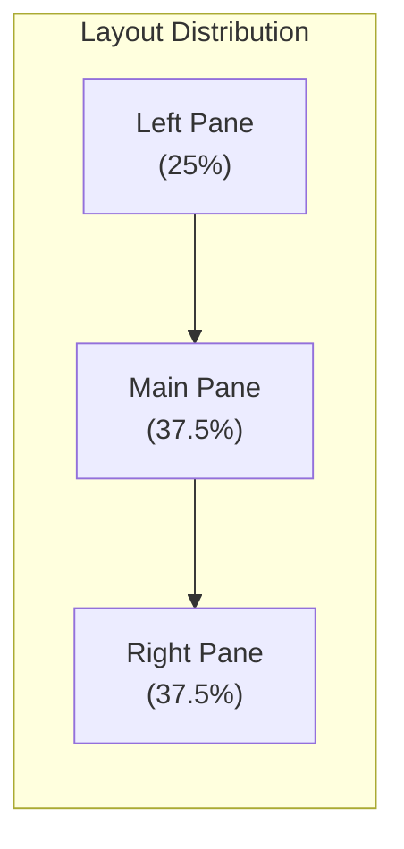
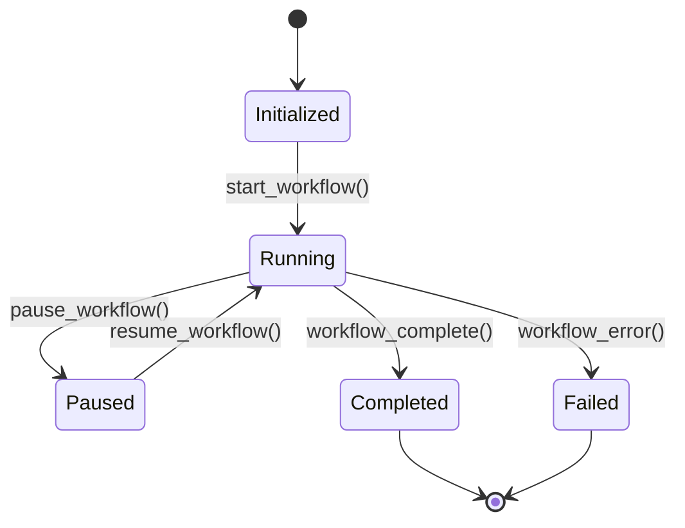

# GraphMCP Workflow UI Specification

## 1. Core Design Principles

### 1.1 Visual Hierarchy & Information Density
- **Progressive Disclosure**: Complex workflows broken into digestible steps
- **Information Hierarchy**: Critical workflow controls prominent, secondary information accessible but not overwhelming
- **Density Balance**: Optimized information density for professional users while maintaining clarity

### 1.2 Interaction Design
- **Real-time Feedback**: Immediate visual response to user actions
- **Error Prevention**: Clear confirmation for destructive actions
- **Accessibility**: WCAG 2.1 compliance with high contrast ratios and keyboard navigation

### 1.3 Consistency & Patterns
- **Unified Components**: Consistent styling for buttons, tables, and status indicators
- **Predictable Behavior**: Similar actions produce similar results across all panes
- **Visual Language**: Cohesive color system for status states (running, success, error)

## 2. Layout Architecture

### 2.1 Three-Pane Distribution


### 2.2 Pane Specifications

#### Left Pane (Control Center)
- **Primary Controls**
  - Start/Stop Button
    - State: st.session_state.workflow_running
    - Updates: Real-time (100ms)
  - Auto-refresh Toggle
    - State: st.session_state.auto_refresh
    - Updates: On click
  - Progress Indicator
    - Type: Linear progress bar
    - Updates: Every 500ms
    - Shows: Overall workflow completion

#### Main Pane (Log Stream)
- **Log Display**
  - Real-time updates
  - Grouped by step/category
  - Status indicators (🔄 ✅ ❌)
  - Timestamp precision
- **Batch Processing Display**
  ```
  🔄 Processing Files (Category: {source_type})
  | File Path | Size | Status |
  |-----------|------|--------|
  | path1.py  | 2KB  | ✅     |
  | path2.sql | 1KB  | 🔄     |
  ```

#### Right Pane (Analytics)
- **Progress Tables**
  - File processing status
  - Source type distribution
  - Success/failure metrics
- **Performance Metrics**
  - Processing speed
  - Error rates
  - Resource utilization

## 3. State Management

### 3.1 Session State Interface
```python
class SessionState:
    # Workflow Control
    workflow_id: str | None
    workflow_running: bool
    auto_refresh: bool
    
    # UI State
    selected_step: str | None
    expanded_sections: Set[str]
    last_refresh: datetime
    error_count: int
```

### 3.2 Update Cycles
- **Real-time Updates**
  - Log Entries: Immediate
  - Status Changes: 100ms
  - Progress Bars: 500ms
  - Analytics: 1s

## 4. Component Specifications

### 4.1 WorkflowControls
```python
class WorkflowControls:
    def render(self):
        """Renders workflow control elements"""
    
    def start_workflow(self):
        """Initiates workflow execution"""
    
    def stop_workflow(self):
        """Halts workflow execution"""
```

### 4.2 LogStream
```python
class LogStream:
    def add_entry(self, entry: LogEntry):
        """Adds new log entry with proper formatting"""
    
    def update_entry(self, entry_id: str, status: str):
        """Updates existing entry status"""
```

### 4.3 ProgressTable
```python
class ProgressTable:
    def create_entry(self, file_data: Dict) -> str:
        """Creates new progress entry"""
    
    def update_entry(self, entry_id: str, status: str):
        """Updates entry status"""
```

## 5. Interaction Patterns

### 5.1 Workflow States


### 5.2 User Actions
- **Start Workflow**: Single click, immediate feedback
- **Stop Workflow**: Requires confirmation
- **View Details**: Click on log entry
- **Filter Results**: Dynamic filtering in right pane
- **Export Data**: Available for completed workflows

## 6. Error Handling

### 6.1 Visual Feedback
- **Error States**: Clear visual distinction
- **Recovery Options**: Guided error resolution
- **Status Messages**: Non-technical language

### 6.2 Failure Modes
- **Graceful Degradation**: Maintain core functionality
- **Auto-retry**: For transient failures
- **Manual Intervention**: Clear action paths

## 7. Performance Considerations

### 7.1 Optimization Targets
- **Initial Load**: < 2s
- **Action Response**: < 100ms
- **Update Frequency**: Optimized by component
- **Memory Usage**: Efficient state management

### 7.2 Caching Strategy
- **Session Data**: Browser storage
- **Static Assets**: CDN delivery
- **API Results**: Request caching

## 8. Accessibility Features

### 8.1 Core Requirements
- **Keyboard Navigation**: Full support
- **Screen Reader**: ARIA labels
- **Color Contrast**: WCAG AA compliance
- **Focus Management**: Clear indicators

### 8.2 Enhanced Features
- **Reduced Motion**: Respects user preferences
- **Font Scaling**: Responsive text size
- **Alternative Text**: For all status icons

## 9. Implementation Guidelines

### 9.1 Development Practices
- **Component Isolation**: Clear boundaries
- **State Management**: Centralized control
- **Error Boundaries**: Graceful fallbacks
- **Testing Coverage**: Unit and integration

### 9.2 Quality Assurance
- **Automated Tests**: Critical paths
- **Performance Monitoring**: Real-time metrics
- **Error Tracking**: Comprehensive logging
- **User Feedback**: Analytics integration 